# Applied Agentic AI Laboratory — Complete Experiment, Workflow & Execution Guide

**Course Code:** MR23-1CS0436
**Course Name:** Applied Agentic AI
**Laboratory:** Applied Agentic AI Laboratory
**Repository:** Applied-Agentic-AI-Lab-Experiments
**Current Completed Experiments:** 3 / 12
**Status:** Living Master Laboratory Reference Guide

---

## Master Table of Contents
- [1. Laboratory Overview](#1-laboratory-overview)
- [2. Repository Architecture](#2-repository-architecture)
- [3. Common Environment Setup](#3-common-environment-setup)
- [4. Repository Directory Structure](#4-repository-directory-structure)
- [5. Experiment Status Matrix](#5-experiment-status-matrix)
- [6. Experiment 01 — Text-to-SQL Workflow](#6-experiment-01--text-to-sql-workflow)
  - [A. Experiment Identification](#a-experiment-01-identification)
  - [B. Aim](#b-experiment-01-aim)
  - [C. Problem Statement](#c-experiment-01-problem-statement)
  - [D. Learning Objectives](#d-experiment-01-learning-objectives)
  - [E. Concepts Used](#e-experiment-01-concepts-used)
  - [F. Why This Experiment Matters](#f-experiment-01-why-this-experiment-matters)
  - [G. Complete System Architecture](#g-experiment-01-complete-system-architecture)
  - [H. Complete Workflow](#h-experiment-01-complete-workflow)
  - [I. Internal Data Flow](#i-experiment-01-internal-data-flow)
  - [J. Folder Structure](#j-experiment-01-folder-structure)
  - [K. Technology Stack](#k-experiment-01-technology-stack)
  - [L. Installation](#l-experiment-01-installation)
  - [M. Exact Execution Procedure](#m-experiment-01-exact-execution-procedure)
  - [N. How to Use the UI](#n-experiment-01-how-to-use-the-ui)
  - [O. Demonstration Procedure](#o-experiment-01-demonstration-procedure)
  - [P. Sample Inputs](#p-experiment-01-sample-inputs)
  - [Q. Expected Outputs](#q-experiment-01-expected-outputs)
  - [R. Screenshots](#r-experiment-01-screenshots)
  - [S. Testing](#s-experiment-01-testing)
  - [T. Safety / Validation](#t-experiment-01-safety--validation)
  - [U. Limitations](#u-experiment-01-limitations)
  - [V. Troubleshooting](#v-experiment-01-troubleshooting)
  - [W. Viva Questions](#w-experiment-01-viva-questions)
  - [X. Conclusion](#x-experiment-01-conclusion)
- [7. Experiment 02 — RAG-Based Question Answering System](#7-experiment-02--rag-based-question-answering-system)
  - [A. Experiment Identification](#a-experiment-02-identification)
  - [B. Aim](#b-experiment-02-aim)
  - [C. Problem Statement](#c-experiment-02-problem-statement)
  - [D. Learning Objectives](#d-experiment-02-learning-objectives)
  - [E. Concepts Used](#e-experiment-02-concepts-used)
  - [F. Why This Experiment Matters](#f-experiment-02-why-this-experiment-matters)
  - [G. Complete System Architecture](#g-experiment-02-complete-system-architecture)
  - [H. Complete Workflow](#h-experiment-02-complete-workflow)
  - [I. Internal Data Flow](#i-experiment-02-internal-data-flow)
  - [J. Folder Structure](#j-experiment-02-folder-structure)
  - [K. Technology Stack](#k-experiment-02-technology-stack)
  - [L. Installation](#l-experiment-02-installation)
  - [M. Exact Execution Procedure](#m-experiment-02-exact-execution-procedure)
  - [N. How to Use the UI](#n-experiment-02-how-to-use-the-ui)
  - [O. Demonstration Procedure](#o-experiment-02-demonstration-procedure)
  - [P. Sample Inputs](#p-experiment-02-sample-inputs)
  - [Q. Expected Outputs](#q-experiment-02-expected-outputs)
  - [R. Screenshots](#r-experiment-02-screenshots)
  - [S. Testing](#s-experiment-02-testing)
  - [T. Safety / Validation](#t-experiment-02-safety--validation)
  - [U. Limitations](#u-experiment-02-limitations)
  - [V. Troubleshooting](#v-experiment-02-troubleshooting)
  - [W. Viva Questions](#w-experiment-02-viva-questions)
  - [X. Conclusion](#x-experiment-02-conclusion)
- [8. Experiment 03 — Prompt Chaining for Summarization](#8-experiment-03--prompt-chaining-for-summarization)
  - [A. Experiment Identification](#a-experiment-03-identification)
  - [B. Aim](#b-experiment-03-aim)
  - [C. Problem Statement](#c-experiment-03-problem-statement)
  - [D. Learning Objectives](#d-experiment-03-learning-objectives)
  - [E. Concepts Used](#e-experiment-03-concepts-used)
  - [F. Why This Experiment Matters](#f-experiment-03-why-this-experiment-matters)
  - [G. Complete System Architecture](#g-experiment-03-complete-system-architecture)
  - [H. Complete Workflow](#h-experiment-03-complete-workflow)
  - [I. Internal Data Flow](#i-experiment-03-internal-data-flow)
  - [J. Folder Structure](#j-experiment-03-folder-structure)
  - [K. Technology Stack](#k-experiment-03-technology-stack)
  - [L. Installation](#l-experiment-03-installation)
  - [M. Exact Execution Procedure](#m-experiment-03-exact-execution-procedure)
  - [N. How to Use the UI](#n-experiment-03-how-to-use-the-ui)
  - [O. Demonstration Procedure](#o-experiment-03-demonstration-procedure)
  - [P. Sample Inputs](#p-experiment-03-sample-inputs)
  - [Q. Expected Outputs](#q-experiment-03-expected-outputs)
  - [R. Screenshots](#r-experiment-03-screenshots)
  - [S. Testing](#s-experiment-03-testing)
  - [T. Safety / Validation](#t-experiment-03-safety--validation)
  - [U. Limitations](#u-experiment-03-limitations)
  - [V. Troubleshooting](#v-experiment-03-troubleshooting)
  - [W. Viva Questions](#w-experiment-03-viva-questions)
  - [X. Conclusion](#x-experiment-03-conclusion)
- [9. Comparison of Experiments 01–03](#9-comparison-of-experiments-0103)
- [10. Common Execution Guide](#10-common-execution-guide)
- [11. Troubleshooting Guide](#11-troubleshooting-guide)
- [12. Testing Guide](#12-testing-guide)
- [13. Git & GitHub Workflow](#13-git--github-workflow)
- [14. Faculty Demonstration Cheat Sheet](#14-faculty-demonstration-cheat-sheet)
- [15. Viva Preparation Guide](#15-viva-preparation-guide)
- [16. Future Experiments Overview (04–12)](#16-future-experiments-overview-0412)
- [17. Master Guide Maintenance Policy](#17-master-guide-maintenance-policy)

---

## 1. Laboratory Overview

### What is Applied Agentic AI?
**Applied Agentic AI** represents the evolution of artificial intelligence from passive input-output text generation to **autonomous, goal-driven computational systems**. While traditional Large Language Models (LLMs) act as static statistical generators, **Agentic AI systems** leverage reasoning loops, memory structures, vector indices, external database tools, prompt chaining pipelines, and multi-agent collaboration to execute multi-step complex workflows.

### Purpose of this Laboratory
This laboratory course (**MR23-1CS0436**) provides a rigorous, hands-on framework for engineering production-ready Agentic AI applications. Students bridge the gap between theoretical artificial intelligence principles and software architecture by designing, building, testing, and evaluating 12 isolated agentic modules.

### Pedagogical Progression
The 12-experiment sequence advances systematically across five core paradigms:
1. **Tool Augmented Retrieval & Workflows** (Experiments 01–03): Structuring schema-driven SQL generation, hybrid vector-lexical RAG retrieval, and 6-stage sequential prompt chaining.
2. **ReAct & Autonomous Agents** (Experiments 04–06): Building tool-using reasoning agents, multi-agent sales SDR teams, and policy compliance verification agents.
3. **Deep Reflection & Multimodal Intelligence** (Experiments 07–09): Implementing iterative self-reflection loops, visual QA, and reasoning model benchmarks.
4. **Model Adaptation & Optimization** (Experiments 10–11): Domain fine-tuning (LoRA/PEFT) and post-training quantization.
5. **Capstone Agentic Integration** (Experiment 12): Deploying an enterprise multi-agent RAG ecosystem.

---

## 2. Repository Architecture

The repository **`Applied-Agentic-AI-Lab-Experiments`** is structured into isolated, self-contained experiment directories (`experiment-01-text-to-sql`, `experiment-02-rag-qa`, `experiment-03-prompt-chaining`, etc.). Each experiment functions as an independent software package with its own:
- Dedicated virtual environment and `requirements.txt`
- Server entry point (`app/main.py`)
- Pydantic schema contracts (`app/schemas.py`) and application settings (`app/config.py`)
- Business logic services (`app/services/*`)
- Glassmorphic Web Application UI (`app/static/*`)
- Unit and integration test suite (`tests/*`)
- Empirical execution screenshots (`screenshots/*`)

---

## 3. Common Environment Setup

### Prerequisites
- **Operating System:** Windows 10/11 (PowerShell), Linux, or macOS
- **Python Runtime:** Python 3.10, 3.11, or 3.14 (Verified on Python 3.14.6)
- **Package Manager:** `pip`
- **Git Version Control:** Git 2.x+

### Environment Configuration Standard
Every experiment includes a safe configuration template (`.env.example`). Real secrets and local API keys are placed inside `.env` (which is strictly excluded by `.gitignore`).

#### Windows PowerShell Setup Pattern:
```powershell
cd "D:\Agentic AI Experiments\experiment-01-text-to-sql"
python -m venv venv
.\venv\Scripts\activate
pip install -r requirements.txt
Copy-Item .env.example .env
```

#### Linux / macOS Setup Pattern:
```bash
cd "D:/Agentic AI Experiments/experiment-01-text-to-sql"
python3 -m venv venv
source venv/bin/activate
pip install -r requirements.txt
cp .env.example .env
```

---

## 4. Repository Directory Structure

```
D:\Agentic AI Experiments/
│
├── README.md                           # Master repository summary & status matrix
├── AGENTIC_AI_LAB_COMPLETE_GUIDE.md    # Living Master Laboratory Guide (THIS DOCUMENT)
├── LICENSE                             # MIT License
├── .gitignore                          # Excludes secrets, venvs, cache, and DBs
│
├── experiment-01-text-to-sql/          # Exp 01: Text-to-SQL LLM Workflow (Port 8000)
│   ├── README.md
│   ├── requirements.txt
│   ├── app/
│   │   ├── main.py                     # FastAPI Entry Point
│   │   ├── config.py                   # Pydantic Settings
│   │   ├── database.py                 # Read-only SQLite Engine & ORM Base
│   │   ├── models.py                   # SQLAlchemy Models (Department, Student, Course, Enrollment, Faculty)
│   │   ├── schemas.py                  # Pydantic Request/Response Schemas
│   │   ├── services/
│   │   │   ├── schema_service.py       # SQLite Schema Introspection & Prompt Formatting
│   │   │   ├── sql_generator.py        # LLM SQL Prompt Construction
│   │   │   ├── sql_validator.py        # Token-Based Read-Only Security Validator
│   │   │   ├── query_service.py        # 6-Step Text-to-SQL Orchestrator
│   │   │   └── llm_service.py          # Grounded Generator (Mock & Real LLMs)
│   │   └── static/                     # HTML5/CSS/JS Chatbot UI
│   ├── data/
│   │   ├── university.db               # SQLite Relational Database
│   │   └── seed.py                     # Database Seed Data Script
│   ├── tests/                          # 8 PyTest Unit/Integration Tests
│   └── screenshots/                    # 4 Verified Screenshots
│
├── experiment-02-rag-qa/               # Exp 02: Cybersecurity Hybrid RAG QA (Port 8001)
│   ├── README.md
│   ├── requirements.txt
│   ├── app/
│   │   ├── main.py                     # FastAPI Entry Point
│   │   ├── config.py                   # RAG System Settings
│   │   ├── schemas.py                  # Pydantic Schemas
│   │   ├── services/
│   │   │   ├── document_loader.py      # Markdown Knowledge Base Loader
│   │   │   ├── chunking_service.py     # Heading-Aware Text Chunker
│   │   │   ├── query_normalization.py  # Acronym & Term Normalizer
│   │   │   ├── embedding_service.py    # Dense 384-Dim Subword Embedder
│   │   │   ├── vector_store.py         # Vector Indexing & Cosine Search
│   │   │   ├── retrieval_service.py    # Hybrid Vector+Lexical Retrieval Engine
│   │   │   ├── llm_service.py          # Grounded Answer Synthesizer
│   │   │   └── rag_service.py          # 6-Step RAG Pipeline Orchestrator
│   │   └── static/                     # Glassmorphic RAG Assistant UI
│   ├── data/knowledge_base/            # 9 Synthetic Cybersecurity Markdown Files
│   ├── index/vector_index.json         # Persisted Vector & Text Index (37 Chunks)
│   ├── tests/                          # 20 PyTest Unit/Integration Tests
│   └── screenshots/                    # 5 Verified Screenshots
│
├── experiment-03-prompt-chaining/      # Exp 03: 6-Stage Prompt Chaining Summarizer (Port 8002)
│   ├── README.md
│   ├── requirements.txt
│   ├── app/
│   │   ├── main.py                     # FastAPI Entry Point
│   │   ├── config.py                   # Studio Settings
│   │   ├── schemas.py                  # Pydantic API Schemas
│   │   ├── services/
│   │   │   ├── text_processor.py       # Metrics & Text Cleaning
│   │   │   ├── llm_service.py          # 6-Stage Prompt Generator
│   │   │   └── chain_service.py        # Sequential Chain Orchestrator
│   │   └── static/                     # Studio Workspace UI
│   ├── tests/                          # 17 PyTest Unit/Integration Tests
│   └── screenshots/                    # 5 Verified Screenshots
│
├── experiment-04-sql-agent/            # Exp 04: ReAct SQL Agent with Tool Use (Pending)
├── experiment-05-multi-agent-sdr/      # Exp 05: Multi-Agent SDR System (Pending)
├── experiment-06-policy-compliance/   # Exp 06: Policy Compliance Agent (Pending)
├── experiment-07-deep-research/        # Exp 07: Deep Research Agent Workflow (Pending)
├── experiment-08-visual-qa/            # Exp 08: Visual QA & Image Retrieval (Pending)
├── experiment-09-reasoning-benchmark/  # Exp 09: Reasoning Model Benchmarking (Pending)
├── experiment-10-fine-tuning/          # Exp 10: Fine-Tuning Domain Adaptation (Pending)
├── experiment-11-model-optimization/  # Exp 11: Model Quantization & Distillation (Pending)
└── experiment-12-capstone/             # Exp 12: Mini Project Capstone (Pending)
```

---

## 5. Experiment Status Matrix

| Exp # | Experiment Title | Core AI Concept | Primary Interface | Status | Port | Test Count | Documentation |
| :---: | :--- | :--- | :--- | :---: | :---: | :---: | :---: |
| **01** | Text-to-SQL Workflow | Schema Context & Lexical Read-Only Security Validation | Interactive Web App | ✅ Completed | `8000` | 8 Passed | `README.md` & Master Guide |
| **02** | RAG-Based QA System | Hybrid Vector+Lexical RAG & Term Normalization | Interactive Web App | ✅ Completed | `8001` | 20 Passed | `README.md` & Master Guide |
| **03** | Prompt Chaining Summarizer | 6-Stage Context Propagation & Quality Metrics | Interactive Web App | ✅ Completed | `8002` | 17 Passed | `README.md` & Master Guide |
| **04** | SQL Agent with Tool Use | ReAct Reasoning Loop & Schema Reflection | Web Dashboard | ⬜ Pending | `8003` | — | Pending |
| **05** | Multi-Agent SDR System | Autonomous Multi-Agent Role Collaboration | Web Dashboard | ⬜ Pending | `8004` | — | Pending |
| **06** | Policy Compliance Agent | Rule Evaluation & Synthetic Safeguards | Web Dashboard | ⬜ Pending | `8005` | — | Pending |
| **07** | Deep Research Agent | Planning & Iterative Self-Reflection | Web Dashboard | ⬜ Pending | `8006` | — | Pending |
| **08** | Visual QA & Image Search | Multimodal Vision QA & Feature Search | Web Dashboard | ⬜ Pending | `8007` | — | Pending |
| **09** | Reasoning Model Benchmark | Benchmark & CoT Prompting Comparison | Web Dashboard | ⬜ Pending | `8008` | — | Pending |
| **10** | Fine-Tuning Adaptation | LoRA / PEFT Model Domain Adaptation | CLI & Notebook | ⬜ Pending | `8009` | — | Pending |
| **11** | Model Optimization | Post-Training Quantization & Distillation | CLI & Notebook | ⬜ Pending | `8010` | — | Pending |
| **12** | Capstone Mini Project | End-to-End Multi-Agent RAG Ecosystem | Full Web Portal | ⬜ Pending | `8011` | — | Pending |

---

## 6. Experiment 01 — Text-to-SQL Workflow

### A. Experiment 01 Identification
- **Experiment Number:** 01
- **Experiment Name:** Text-to-SQL Workflow
- **Course Code:** MR23-1CS0436
- **Status:** ✅ Completed & Verified
- **Directory:** `experiment-01-text-to-sql`
- **Main Technology:** Python 3.10+, FastAPI, SQLite, SQLAlchemy ORM, Pydantic v2, HTML5/CSS Glassmorphism
- **Interface Type:** Web-Based Chatbot with Schema Viewer & Execution Visualizer
- **Default Runtime Mode:** Offline Grounded Mode (`MockLLMProvider`) / Configurable External LLM
- **Default Port:** `8000`

### B. Experiment 01 Aim
To design, implement, and evaluate an automated Text-to-SQL LLM workflow that translates natural language database questions into syntactically valid SQLite queries, enforces read-only safety, executes queries against a university database, and formats natural language answers with execution evidence.

### C. Experiment 01 Problem Statement
Enterprise relational databases store mission-critical structured data, but querying them requires expertise in Structured Query Language (SQL). Non-technical stakeholders struggle to write SQL queries. Directly connecting an unconstrained LLM to a database poses security risks (SQL injection, accidental `DROP TABLE` or `DELETE` operations) and hallucination risks (inventing non-existent column names). A structured Text-to-SQL workflow bridges natural language to SQL safely by inspecting active database schemas, validating generated SQL syntax, enforcing read-only constraints, and providing transparent query execution.

### D. Experiment 01 Learning Objectives
1. **Database Schema Extraction:** Automatically inspect SQLite database catalogs (`sqlite_master`, `PRAGMA table_info`) and format schemas into LLM prompts.
2. **Context-Aware SQL Generation:** Prompt LLMs to map natural language questions into valid SQL queries targeting exact tables and columns.
3. **Lexical & Token-Based Security Validation:** Implement a multi-tier SQL validator enforcing read-only `SELECT` queries while rejecting destructive statements (`DROP`, `DELETE`, `UPDATE`, `INSERT`, `ALTER`).
4. **Safe Query Execution & Explanation:** Execute validated SQL against a live SQLite database and synthesize conversational explanations with structured tabular results.

### E. Experiment 01 Concepts Used

#### 1. Schema Prompt Injection
LLMs cannot infer database tables or column names out of context. The schema loader (`app/services/schema_service.py`) dynamically extracts CREATE TABLE statements and column types from `university.db`, building an authoritative schema context block:
$$\text{PromptContext} = \text{UserQuestion} + \text{DatabaseSchema} + \text{DialectRules}$$

#### 2. Lexical & Token-Based Read-Only Security Validation
Before any query executes against SQLite, `app/services/sql_validator.py` evaluates the raw SQL string using regular expressions and token extraction:
1. Strips Markdown code block formatting wrappers (` ```sql `, ` ``` `) and trailing semicolons.
2. Rejects multiple SQL statements by scanning for semicolons outside string literals.
3. Requires `SELECT` or `WITH` as the leading statement keyword.
4. Tokenizes keywords using regular expressions (`re.findall(r'\b[A-Z_]+\b', upper_query)`).
5. Checks tokens against a list of prohibited DML/DDL keywords (`INSERT`, `UPDATE`, `DELETE`, `DROP`, `ALTER`, `TRUNCATE`, `CREATE`, `REPLACE`, `ATTACH`, `DETACH`, `PRAGMA`, `EXEC`, `EXECUTE`, `GRANT`, `REVOKE`, `VACUUM`, `REINDEX`).
6. Only safe queries passing validation are forwarded to the database execution layer.

#### 3. Structured Output Formatting
The system structures response objects using Pydantic models (`QueryResponse`), returning the question, generated SQL, execution status, tabular results, natural language explanation, and workflow timing steps.

### F. Experiment 01 Why This Experiment Matters
Text-to-SQL is the foundational architecture for business intelligence (BI) assistants, internal analytics dashboards, and executive reporting systems. It allows non-technical users to ask questions like *"Top 5 students by CGPA"* and receive instant database answers safely.

### G. Experiment 01 Complete System Architecture

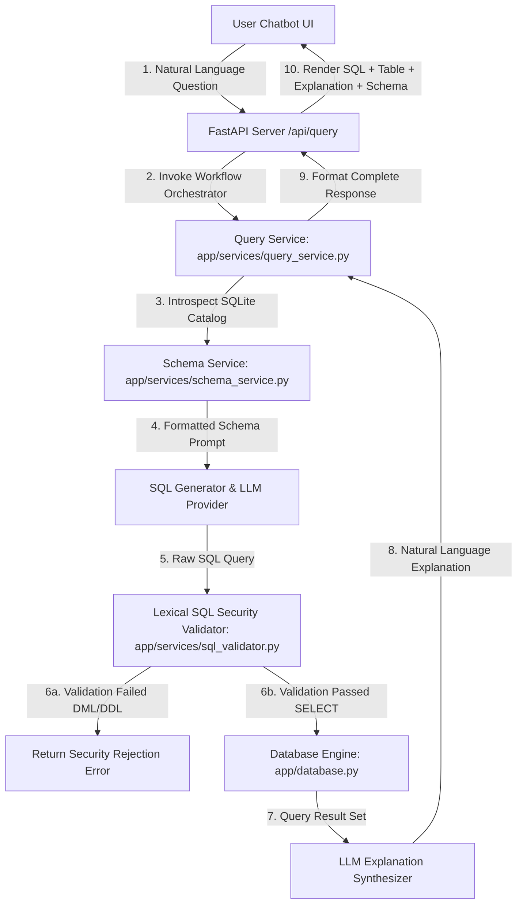

#### Component Breakdown
- **Web UI (`static/`)**: Glassmorphic frontend rendering chat messages, active schema tree, interactive sample chips, and execution workflow badges.
- **FastAPI Router (`app/main.py`)**: Endpoints for `/api/query`, `/api/schema`, and `/api/health`.
- **Database Engine (`app/database.py`)**: Connects to `data/university.db`. Primary execution path attempts SQLite URI read-only mode (`file:{db_path}?mode=ro`). If URI mode fails due to an `OperationalError`, it falls back to standard SQLite connection (`sqlite3.connect(db_path)`), with `app/services/sql_validator.py` acting as the application-level safeguard.
- **SQL ORM Models (`app/models.py`)**: Defines SQLAlchemy schemas for `departments`, `students`, `courses`, `enrollments`, and `faculty`.
- **Schema Service (`app/services/schema_service.py`)**: Connects to `data/university.db` and inspects tables and column metadata.
- **Lexical Security Validator (`app/services/sql_validator.py`)**: Validates generated SQL against non-SELECT syntax and forbidden keywords using token matching.
- **Query Orchestrator (`app/services/query_service.py`)**: Manages the 6 pipeline workflow steps.

### H. Experiment 01 Complete Workflow

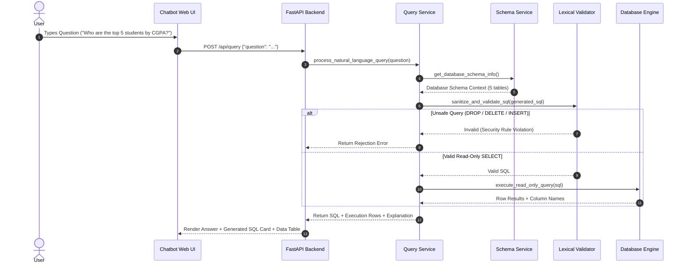

### I. Experiment 01 Internal Data Flow
1. **Input**: User submits `"List all computer science courses with 4 credits"`.
2. **Schema Inspection**: `schema_service.py` formats table definitions for `courses` (id, course_code, course_name, department_id, credits) and `departments` (id, name, code).
3. **Generation**: `sql_generator.py` produces `SELECT course_code, course_name, credits FROM courses WHERE department_id = 1 AND credits = 4;`.
4. **Validation**: `sql_validator.py` confirms query begins with `SELECT`, contains no multiple statements, and contains no forbidden DML/DDL tokens.
5. **Execution**: `database.py` executes query on `university.db` and returns matching rows.
6. **Output**: UI displays natural language explanation, formatted SQL block, and execution data table.

### J. Experiment 01 Folder Structure

```
experiment-01-text-to-sql/
├── README.md                           # Lab Report & Documentation
├── requirements.txt                    # Dependencies (FastAPI, uvicorn, pydantic, sqlalchemy, pytest)
├── app/
│   ├── main.py                         # FastAPI Server Entry Point & Router
│   ├── config.py                       # Application Configuration
│   ├── database.py                     # SQLite Connection Engine (execute_read_only_query)
│   ├── models.py                       # SQLAlchemy ORM Models (Department, Student, Course, Enrollment, Faculty)
│   ├── schemas.py                      # Pydantic API Request/Response Schemas
│   ├── services/
│   │   ├── schema_service.py           # SQLite Catalog Introspection & Schema Prompt Builder
│   │   ├── sql_generator.py            # Prompt Construction & LLM Execution
│   │   ├── sql_validator.py            # Token-Based Read-Only SQL Security Validator
│   │   ├── query_service.py            # 6-Step End-to-End Query Orchestrator
│   │   └── llm_service.py              # LLM Provider Abstraction (Mock & Real Providers)
│   └── static/                         # HTML5, Glassmorphic CSS3, Vanilla JS UI
├── data/
│   ├── university.db                   # SQLite Relational Database (5 tables)
│   └── seed.py                         # Database Seeder Script
├── tests/                              # 8 Automated Unit & Integration Tests
└── screenshots/                        # 4 Verification Screenshots & README
```

### K. Experiment 01 Technology Stack

| Technology | Purpose | Where Used |
| :--- | :--- | :--- |
| **Python 3.10+** | Programming Language | Entire Backend Architecture |
| **FastAPI / Uvicorn** | Web Framework & ASGI Server | `app/main.py` |
| **SQLite 3 & SQLAlchemy** | Relational Database Engine & ORM | `data/university.db`, `app/database.py`, `app/models.py` |
| **Pydantic v2** | API Schema Validation & Serialization | `app/schemas.py`, `app/config.py` |
| **Vanilla HTML5/CSS3/JS** | UI Frontend with Glassmorphism Theme | `app/static/*` |

### L. Experiment 01 Installation
Open Windows PowerShell and navigate to the project root:

```powershell
# 1. Navigate to Experiment 01 directory
cd "D:\Agentic AI Experiments\experiment-01-text-to-sql"

# 2. Create isolated virtual environment
python -m venv venv

# 3. Activate virtual environment
.\venv\Scripts\activate

# 4. Install dependencies
pip install -r requirements.txt

# 5. Copy environment template
Copy-Item .env.example .env
```

### M. Experiment 01 Exact Execution Procedure

```powershell
# STEP 1: Ensure virtual environment is active in PowerShell
.\venv\Scripts\activate

# STEP 2: Launch application server using module execution flag (-m)
python -m app.main
```

#### Expected Terminal Output
```
INFO:     Will watch for changes in these directories: ['D:\\Agentic AI Experiments\\experiment-01-text-to-sql']
INFO:     Uvicorn running on http://127.0.0.1:8000 (Press CTRL+C to quit)
INFO:     Started reloader process [14820] using StatReload
INFO:     Started server process [18940]
INFO:     Waiting for application startup.
INFO:     Application startup complete.
```

#### Exact Browser URL
👉 **`http://127.0.0.1:8000`**

### N. How to Use the UI
1. **Header Bar:** Shows title *"University Database AI Assistant"*, course code `MR23-1CS0436`, and active LLM Provider status badge (`MOCK`).
2. **Schema Viewer (Left Panel):** Displays interactive schema cards for 5 tables (`departments`, `students`, `courses`, `enrollments`, `faculty`) with column names, primary keys, and foreign key relationships.
3. **Sample Questions Bar:** Contains quick-click prompt chips (e.g., *"Top 5 students by CGPA"*, *"List all CS courses"*, *"DROP TABLE students;"*).
4. **Chat Window:** Displays user query, animated step workflow, generated SQL query card, interactive execution result table, and natural language explanation.

### O. Experiment 01 Demonstration Procedure
1. Launch `python -m app.main` and open `http://127.0.0.1:8000`.
2. Point out the Schema Viewer panel on the left, demonstrating dynamic schema introspection of `university.db`.
3. Click sample query chip: *"Top 5 students by CGPA"*.
4. Show generated SQL: `SELECT name, roll_number, semester, cgpa FROM students ORDER BY cgpa DESC LIMIT 5;`.
5. Point out execution data table displaying 5 rows.
6. **Safety Demonstration:** Click sample chip *"DROP TABLE students;"*.
7. Point out immediate security rejection banner: *"Query Execution Blocked: Security Violation: Non-SELECT queries are strictly prohibited."*

### P. Sample Inputs
- *"Who are the top 5 students by CGPA?"*
- *"List all courses offered by the Computer Science department."*
- *"Show all faculty members in the Computer Science department."*
- *"DROP TABLE students;"* *(Safety test)*

### Q. Expected Outputs
- **Valid Query:** Returns SQL query block, formatted HTML data table, row count, execution time, and natural language explanation.
- **Destructive Query:** Returns server-side security error card blocking database execution.

### R. Experiment 01 Screenshots

#### Screenshot 1 — Home Dashboard & Schema Viewer

*Figure 1.1: Initial Web UI dashboard of the University Database AI Assistant showing loaded schema tables (`departments`, `students`, `courses`, `enrollments`, `faculty`), sample query chips, and pipeline progress bar.*

#### Screenshot 2 — Text-to-SQL Execution Result

*Figure 1.2: Execution result for natural language question "Who are the top 5 students by CGPA?" showing generated SQL code block, formatted data result table, and conversational explanation.*

#### Screenshot 3 — Schema Inspection & Workflow Bar
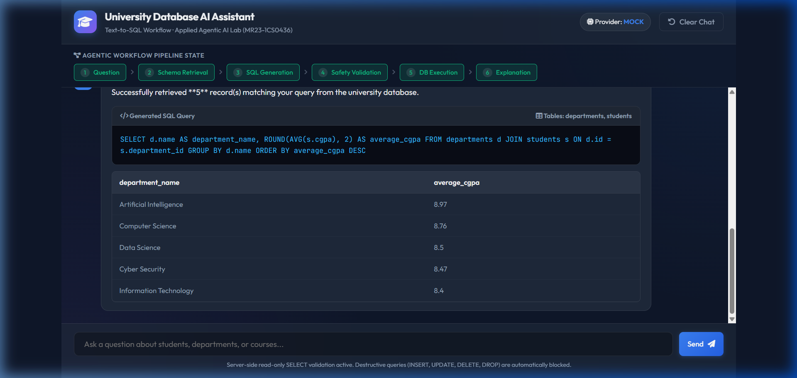
*Figure 1.3: Active 6-stage workflow pipeline bar (Understanding Question → Retrieving Schema → Generating SQL → Validating Query → Executing → Explaining Result) and schema metadata.*

#### Screenshot 4 — Safety & Security Validation

*Figure 1.4: Server-side security rejection alert triggered when attempting an unsafe SQL query ("DROP TABLE students;"), proving read-only enforcement.*

---

### S. Experiment 01 Testing
Run automated test suite from the experiment directory:
```powershell
python -m pytest tests
```
- **Verified Test Result:** `8 passed in 1.35s` (covers health endpoint, schema introspection, SQL validator rules, and query API).

### T. Safety & Validation
- **Read-Only Enforcement:** Token and regex-based keyword parsing in `app/services/sql_validator.py` blocks DML/DDL verbs (`DROP`, `DELETE`, `UPDATE`, `INSERT`, `ALTER`, `TRUNCATE`, `CREATE`, `REPLACE`, `ATTACH`, `DETACH`, `PRAGMA`, `EXEC`, `EXECUTE`, `GRANT`, `REVOKE`, `VACUUM`, `REINDEX`).
- **SQLite Read-Only URI Mode:** `app/database.py` attempts `sqlite3.connect(f"file:{db_path}?mode=ro", uri=True)` with standard connection fallback if URI mode fails, relying on `sql_validator.py` as the application-level safeguard.

### U. Limitations
- **Dialect Specificity:** Prompts are tailored specifically for SQLite syntax.
- **Complex Window Functions:** Multi-nested analytical queries require explicit LLM prompt guidelines.

### V. Troubleshooting & Gotchas
- **`ModuleNotFoundError: No module named 'app'`**: Caused by running `python app\main.py` directly instead of module mode.
  *Fix:* Execute **`python -m app.main`** from `experiment-01-text-to-sql`.
- **Port Conflict (`8000`)**: If port 8000 is occupied, terminate existing processes using `Stop-Process -Name "python" -Force`.

---

### W. Experiment 01 Viva Questions & Answers

1. **Q: How does the Text-to-SQL workflow prevent destructive database operations?**
   *A:* Through a multi-tier safety mechanism: `app/services/sql_validator.py` parses query tokens and rejects any non-`SELECT`/`WITH` statement (blocking `DROP`, `DELETE`, `INSERT`, `UPDATE`, `ALTER`), while `app/database.py` attempts read-only SQLite URI connections (`mode=ro`).

2. **Q: Why is schema context injected into the LLM prompt?**
   *A:* LLMs have no inherent knowledge of private enterprise database schemas. Injecting exact table names, column data types, primary keys, and foreign key relationships provides the necessary structural context for accurate SQL synthesis.

3. **Q: What database tables exist in the Experiment 01 `university.db` database?**
   *A:* The SQLite database contains 5 relational tables: `departments` (id, name, code), `students` (id, name, roll_number, department_id, semester, cgpa), `courses` (id, course_code, course_name, department_id, credits), `enrollments` (id, student_id, course_id, grade), and `faculty` (id, name, department_id, designation).

4. **Q: What happens when a user asks `"DROP TABLE students;"`?**
   *A:* The Lexical SQL Security Validator parses the DDL keyword `DROP`, flags `is_safe = False`, halts pipeline execution before reaching SQLite, and returns a red security violation alert to the UI.

5. **Q: What are the 6 visible workflow steps executed in Experiment 01?**
   *A:* 1. Understanding Question, 2. Retrieving Schema, 3. Generating SQL, 4. Validating Query, 5. Executing, 6. Explaining Result.

6. **Q: Why is module execution (`python -m app.main`) required instead of direct script execution?**
   *A:* Running `python -m app.main` sets the current working directory as the package root on `sys.path`, allowing relative imports like `from app.database import ...` to resolve cleanly without import errors.

7. **Q: How does the Mock LLM Provider function in offline mode?**
   *A:* `app/services/llm_service.py` provides deterministic pattern matching for sample questions, generating pre-validated SQL and natural language summaries without requiring external API keys.

8. **Q: What role does Pydantic play in this architecture?**
   *A:* Pydantic models in `app/schemas.py` enforce strict type checking and JSON schema validation for input queries (`QueryRequest`) and structured API responses (`QueryResponse`).

9. **Q: How are foreign key relationships represented in prompt context?**
   *A:* `schema_service.py` introspects foreign keys via SQLite `PRAGMA foreign_key_list` and appends explicit mapping strings (e.g., `students.department_id references departments.id`) to the system prompt.

10. **Q: How does the system convert SQLite rows into web-friendly JSON tables?**
    *A:* `database.py` extracts column metadata from `cursor.description`, serializes rows into Python primitive types, and formats them into a clean JSON object returned to the frontend rendering script.

---

### X. Conclusion
Experiment 01 successfully demonstrates an end-to-end Text-to-SQL workflow combining dynamic schema extraction, LLM query generation, lexical security validation, read-only SQLite execution, and interactive visualization.

---

## 7. Experiment 02 — RAG-Based Question Answering System

### A. Experiment 02 Identification
- **Experiment Number:** 02
- **Experiment Name:** Cybersecurity Knowledge RAG Assistant
- **Course Code:** MR23-1CS0436
- **Status:** ✅ Completed & Verified (Commit `002b4f8`)
- **Directory:** `experiment-02-rag-qa`
- **Main Technology:** Python 3.10+, FastAPI, Dense Embedder, Hybrid Retrieval (Vector + Lexical), Query Normalizer
- **Interface Type:** Web-Based Chatbot with Knowledge Base Status, Sources Panel & RAG Inspector
- **Default Runtime Mode:** Offline Grounded Mode (`MockLLMProvider`) / Configurable External LLM
- **Default Port:** `8001`

### B. Experiment 02 Aim
To design, build, and evaluate a Retrieval-Augmented Generation (RAG) system for question answering over a local cybersecurity knowledge base, incorporating document text extraction, heading-aware chunking, query terminology normalization, dense vector embeddings, hybrid vector + lexical retrieval, relevance thresholding, grounded answer synthesis, and source attribution.

### C. Experiment 02 Problem Statement
Standard LLMs suffer from static knowledge cutoffs, hallucination of domain facts, and context window limits when querying large technical archives. Passing full document libraries into LLM prompts causes token overflow and high cost. RAG addresses this by retrieving top-$K$ relevant passages. However, standard pure vector retrieval suffers from false negatives on short technical queries, acronyms (`SQLi`, `MFA`), and subword hashing collisions. Experiment 02 solves this through a principled **Hybrid Retrieval (Vector + Lexical)** architecture and **Query Normalization**.

### D. Experiment 02 Learning Objectives
1. **Heading-Aware Markdown Chunking:** Partition long documents into sliding window chunks while prepending document title and active section header context (`[Title - Section]`).
2. **Query Normalization & Acronym Unrolling:** Map technical acronyms (`SQLi` → `SQL injection`, `MFA` → `multi-factor authentication`) prior to search.
3. **Hybrid Vector + Lexical Retrieval:** Combine dense 384-dim vector similarity with term/phrase lexical matching using a weighted score: $\text{HybridScore} = 0.5 \times \text{VectorScore} + 0.5 \times \text{LexicalScore}$.
4. **Relevance Thresholding & Out-of-KB Safeguards:** Enforce `RELEVANCE_THRESHOLD = 0.25` to reject out-of-domain questions (e.g. *"What is the capital of France?"*) without hallucinating.

### E. Experiment 02 Concepts Used

#### 1. Hybrid Retrieval Architecture
Combining vector space semantic alignment with lexical keyword/phrase precision:
$$\text{HybridScore}(\mathbf{q}, \mathbf{c}_i) = 0.5 \cdot \text{CosineSimilarity}(\mathbf{q}, \mathbf{c}_i) + 0.5 \cdot \text{LexicalScore}(\mathbf{q}, \mathbf{c}_i)$$

#### 2. Subword N-Gram Dense Vector Embedding
Offline 384-dimensional feature vectorizer (`LocalDenseEmbedder`) using character n-gram hashing and $L_2$ normalization:
$$\mathbf{v} = \frac{\mathbf{v}_{\text{raw}}}{\|\mathbf{v}_{\text{raw}}\|_2} \in \mathbb{R}^{384}$$

#### 3. Out-of-Knowledge-Base Safety
If $\max(\text{HybridScore}) < 0.25$, context injection is blocked, and the LLM returns a polite refusal message without inventing facts.

### F. Experiment 02 Why This Experiment Matters
Enterprise RAG systems in cybersecurity, healthcare, and law require extreme retrieval precision. Pure vector search often misses exact acronyms or specific technical terms. Hybrid retrieval guarantees high recall for technical terms while maintaining safety against out-of-kb queries.

### G. Experiment 02 Complete System Architecture

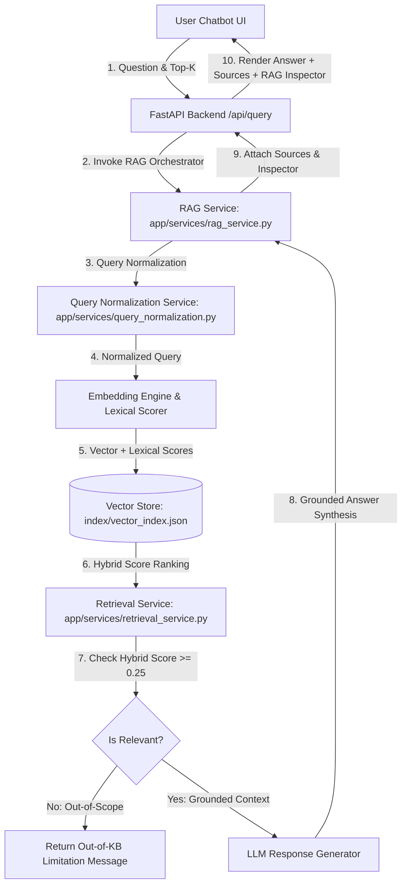

#### Component Breakdown
- **Query Normalizer (`services/query_normalization.py`)**: Maps acronyms (`SQLi`, `MFA`, `SIEM`, `XSS`, `WAF`, `CSRF`, `IDS`, `IPS`, `SOC`, `EDR`, `CSP`).
- **Heading-Aware Chunker (`services/chunking_service.py`)**: Pre-pends section headers to chunk text while preserving sliding window bounds (`CHUNK_SIZE = 400`, `CHUNK_OVERLAP = 60`).
- **Vector Store (`services/vector_store.py`)**: Persists 37 document chunks across 9 Markdown files to `index/vector_index.json`.
- **Hybrid Retriever (`services/retrieval_service.py`)**: Ranks chunks using weighted hybrid vector + lexical scoring.

### H. Experiment 02 Complete Workflow

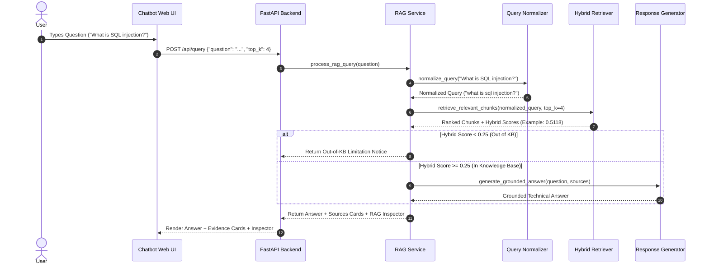

### I. Experiment 02 Internal Data Flow
1. **Input**: User submits `"What is SQL injection?"`.
2. **Normalization**: Query normalized to `"what is sql injection?"`.
3. **Hybrid Search**: Dense vector score (Example from verified run: `0.2917`) + Lexical phrase score (Example: `0.7318`) = Hybrid Score (Example: `0.5118`).
4. **Ranking**: `04_web_application_security.md` (chunk `doc_04_chunk_04`) ranks #1.
5. **Thresholding**: Hybrid score (`0.5118 >= 0.25`) → Status: In KB (`is_out_of_scope = False`).
6. **Output**: Grounded answer generated with source evidence card and RAG Inspector diagnostics.

### J. Experiment 02 Folder Structure

```
experiment-02-rag-qa/
├── README.md                           # Comprehensive Experiment Report
├── requirements.txt                    # Project Dependencies
├── app/
│   ├── main.py                         # FastAPI Server Entry Point & Router
│   ├── config.py                       # RAG System Settings
│   ├── schemas.py                      # Pydantic API Schemas
│   ├── services/
│   │   ├── document_loader.py          # Markdown Document Extraction
│   │   ├── chunking_service.py         # Heading-Aware Text Chunker
│   │   ├── query_normalization.py      # Cybersecurity Acronym Normalizer
│   │   ├── embedding_service.py        # Dense 384-Dim Vector Embedder
│   │   ├── vector_store.py             # Vector Indexer & Storage Engine
│   │   ├── retrieval_service.py        # Hybrid Vector + Lexical Retriever
│   │   ├── llm_service.py              # Grounded Answer Synthesizer
│   │   └── rag_service.py              # 6-Step RAG Pipeline Orchestrator
│   └── static/                         # Glassmorphic RAG Assistant UI
├── data/knowledge_base/                # 9 Synthetic Cybersecurity Markdown Files
├── index/vector_index.json             # Persisted Vector & Text Index (37 Chunks)
├── tests/                              # 20 Automated Unit & Integration Tests
│   └── diagnose_retrieval.py           # Diagnostic Script for Retrieval Quality
└── screenshots/                        # 5 Verification Screenshots & README
```

### K. Experiment 02 Technology Stack

| Technology | Purpose | Where Used |
| :--- | :--- | :--- |
| **Python 3.10+** | Language Runtime | Core Backend Services |
| **FastAPI / Uvicorn** | Web Framework | `app/main.py` |
| **LocalDenseEmbedder** | 384-Dim Subword Dense Vector Engine | `app/services/embedding_service.py` |
| **JSON Vector Store** | Vector Index Persistence | `index/vector_index.json`, `app/services/vector_store.py` |
| **Vanilla HTML5/CSS/JS** | Glassmorphic Interface | `app/static/*` |

### L. Experiment 02 Installation
```powershell
cd "D:\Agentic AI Experiments\experiment-02-rag-qa"
python -m venv venv
.\venv\Scripts\activate
pip install -r requirements.txt
Copy-Item .env.example .env
```

### M. Experiment 02 Exact Execution Procedure
```powershell
.\venv\Scripts\activate
python -m app.main
```
#### Exact Browser URL
👉 **`http://127.0.0.1:8001`**

### N. How to Use the UI
1. **Header Panel:** Displays Knowledge Base stats (9 Documents, 37 Chunks Indexed, Model `local-dense-384`).
2. **Sample Prompt Chips:** Quick query buttons (*"What is SQL Injection?"*, *"Explain MFA"*, *"What is phishing?"*, *"Capital of France (Out of KB Test)"*).
3. **Chat Feed:** Displays answer markdown text.
4. **Retrieved Sources Panel:** Shows retrieved document cards with Hybrid Match percentage, Chunk ID, Vector/Lexical breakdown, and text excerpt.
5. **Collapsible RAG Inspector:** Expands to show raw diagnostics (Normalized Query, Hybrid Score, Vector Score, Lexical Score, Retrieval Strategy).

### O. Experiment 02 Demonstration Procedure
1. Launch `python -m app.main` and open `http://127.0.0.1:8001`.
2. Click chip *"What is SQL Injection?"*.
3. Point out Rank #1 source: `Web Application Security` (Example: `51% Hybrid Match`).
4. Expand RAG Inspector to show Hybrid Score (Example: `0.5118`), Vector Score (`0.2917`), and Lexical Score (`0.7318`).
5. Click chip *"Explain MFA"* to demonstrate acronym unrolling. Show top source `Authentication and Access Control` (Example: `72% Hybrid Match`).
6. **Out-of-KB Test:** Click chip *"What is the capital of France?"*.
7. Point out rejection notice: *"The cybersecurity knowledge base does not contain sufficient information..."* with 0 evidence sources (Example score: `0.1020 < 0.25`).

### P. Sample Inputs
- *"What is SQL injection?"*
- *"What is SQLi?"*
- *"Explain MFA"*
- *"What is phishing?"*
- *"What is the capital of France?"* *(Out of KB Test)*

### Q. Expected Outputs
- **Cybersecurity Queries:** Grounded answer with matching document evidence card and hybrid scores.
- **Out-of-KB Queries:** Rejection message with zero evidence sources.

### R. Experiment 02 Screenshots

#### Screenshot 1 — Home Dashboard & KB Status
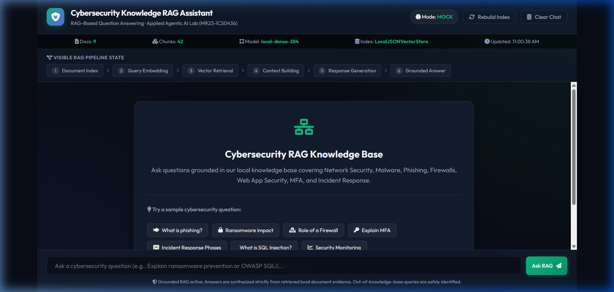
*Figure 2.1: Initial Web UI dashboard of the Cybersecurity Knowledge RAG Assistant showing Knowledge Base status cards (9 documents, 37 chunks), RAG pipeline bar, and sample query chips.*

#### Screenshot 2 — Grounded RAG Retrieval
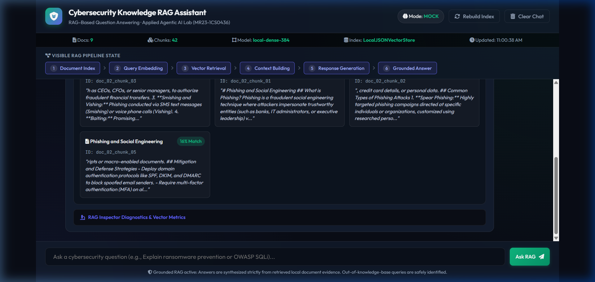
*Figure 2.2: Successful RAG query response ("What is phishing?") showing grounded technical explanation and Retrieved Source Evidence panel with chunk IDs and match percentages.*

#### Screenshot 3 — RAG Inspector Diagnostics
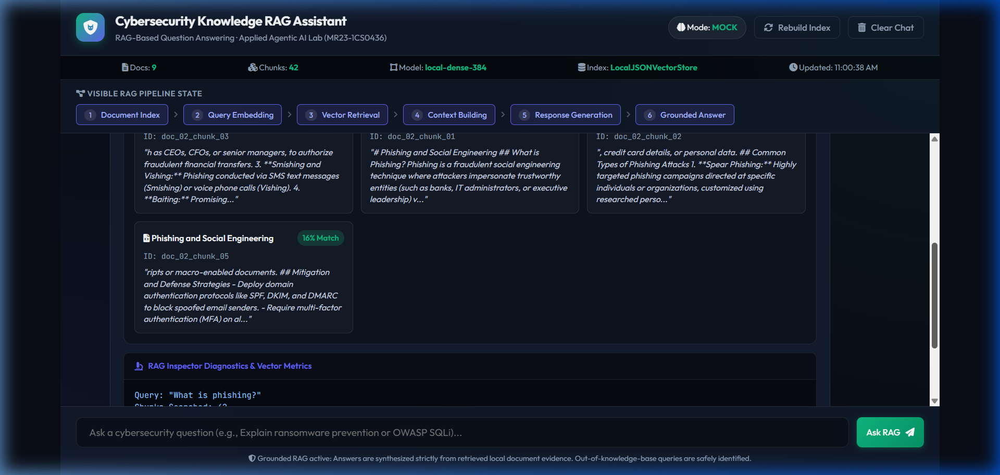
*Figure 2.3: Collapsible RAG Inspector Diagnostics panel expanded to display query embedding metadata, chunks searched, top-K selection, vector store type, and relevance decision.*

#### Screenshot 4 — Out-of-Knowledge-Base Threshold Handling
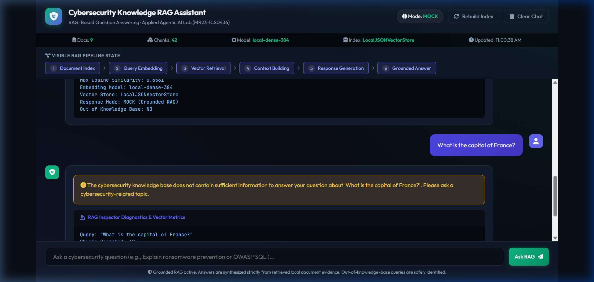
*Figure 2.4: Out-of-knowledge-base query rejection ("What is the capital of France?") demonstrating relevance thresholding (< 0.25) and refusal message with 0 evidence sources.*

#### Screenshot 5 — SQL Injection Hybrid Retrieval Verification
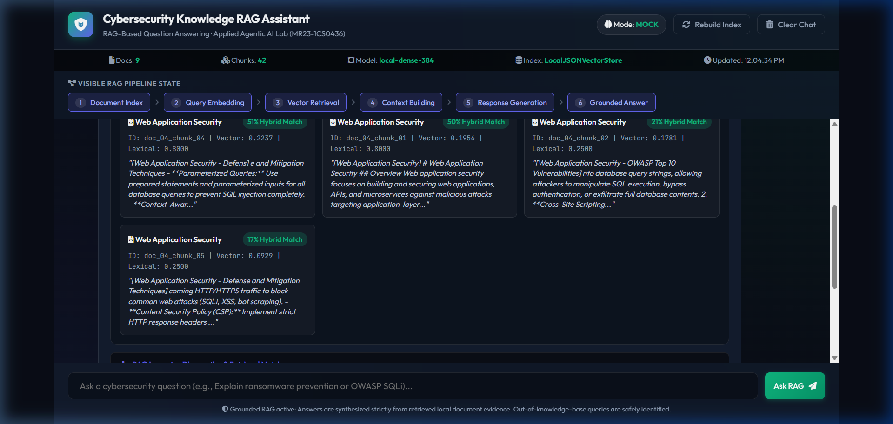
*Figure 2.5: Verified retrieval for "What is SQL Injection?" proving Rank #1 retrieval of Web Application Security (`04_web_application_security.md`) with a 51% Hybrid Match score (Example from verified run) and detailed vector/lexical diagnostics.*

---

### S. Experiment 02 Testing
Run automated test suite:
```powershell
python -m pytest tests
```
- **Verified Test Result:** `20 passed in 0.85s` (covers hybrid retrieval, acronym normalization, chunking metadata, API routes, and out-of-KB safety).

### T. Safety & Validation
- **Grounding Guard:** Answers are strictly synthesized from retrieved passages.
- **Out-of-Scope Shield:** Queries scoring below `0.25` hybrid score are refused.

### U. Limitations
- **Fixed Top-K:** Default $K=4$ retrieves a fixed chunk count regardless of query breadth.

### V. Troubleshooting & Gotchas
- **`ModuleNotFoundError: No module named 'app'`**: Execute **`python -m app.main`** from `experiment-02-rag-qa`.
- **Low similarity on acronyms**: Ensure `query_normalization.py` contains the required alias mapping.

---

### W. Experiment 02 Viva Questions & Answers

1. **Q: Why was Hybrid Retrieval introduced in Experiment 02?**
   *A:* Pure subword vector search yielded low scores (Example: `0.2425`) for short queries like *"What is SQL injection?"*, causing false out-of-KB rejections. Combining vector similarity ($50\%$) with lexical matching ($50\%$) boosted valid queries (Example: `0.5118`) while keeping out-of-domain queries rejected (Example: `0.1020`).

2. **Q: How does Query Normalization improve retrieval?**
   *A:* `app/services/query_normalization.py` expands acronyms (`SQLi` → `SQL injection`, `MFA` → `multi-factor authentication`) so queries match full terms in document titles, headers, and body text.

3. **Q: How does the system handle "What is the capital of France?"**
   *A:* The query scores below threshold (Example: `0.1020 < 0.25`), triggering out-of-scope rejection with 0 evidence sources attached.

4. **Q: What is heading-aware chunking and why is it used?**
   *A:* Heading-aware chunking (`chunking_service.py`) detects Markdown headers (`#`, `##`) and prepends section context (e.g., `[Web Application Security - OWASP Top 10]`) to chunk text, ensuring chunks retain structural document context.

5. **Q: What formula is used to calculate the Hybrid Match score?**
   *A:* $\text{HybridScore} = (0.5 \times \text{VectorScore}) + (0.5 \times \text{LexicalScore})$, where VectorScore is dense Cosine Similarity and LexicalScore measures term and phrase matching.

6. **Q: How many documents and chunks are indexed in the cybersecurity knowledge base?**
   *A:* The knowledge base contains 9 synthetic Markdown documents which are partitioned into 37 vector entries stored in `index/vector_index.json`.

7. **Q: What is the purpose of the RAG Inspector in the UI?**
   *A:* The RAG Inspector is a collapsible diagnostic panel that displays raw pipeline metrics (Normalized Query, Hybrid Score, Vector Score, Lexical Score, Search Strategy, Chunks Searched) for auditability.

8. **Q: How does the dense vector embedding engine operate without external APIs?**
   *A:* `LocalDenseEmbedder` in `embedding_service.py` uses sub-word n-gram frequency hashing and $L_2$ normalization to compute 384-dimensional dense vectors offline.

9. **Q: What are the 6 workflow steps executed in Experiment 02?**
   *A:* 1. Document Index Check, 2. Query Embedding & Normalization, 3. Hybrid Retrieval, 4. Context Building, 5. Response Generation, 6. Grounded Answer.

10. **Q: What is the default relevance threshold setting in `app/config.py`?**
    *A:* `RELEVANCE_THRESHOLD = 0.25`. Any query producing a maximum hybrid score below `0.25` is flagged as out-of-scope (`is_out_of_scope = True`).

---

### X. Conclusion
Experiment 02 demonstrates a production-grade Hybrid RAG Assistant combining heading-aware chunking, term normalization, dense vector embeddings, hybrid scoring, and strict out-of-KB safeguards.

---

## 8. Experiment 03 — Prompt Chaining for Summarization

### A. Experiment 03 Identification
- **Experiment Number:** 03
- **Experiment Name:** Agentic Document Summarization Studio — Prompt Chaining for Summarization
- **Course Code:** MR23-1CS0436
- **Status:** ✅ Completed & Verified
- **Directory:** `experiment-03-prompt-chaining`
- **Main Technology:** Python 3.10+, FastAPI, 6-Stage Sequential Chain Orchestrator, Quality Metrics Engine
- **Interface Type:** Web-Based Application with Interactive Step Progress, Summary Style Controls & Chain Inspector
- **Default Runtime Mode:** Offline Grounded Mode (`MockLLMProvider`) / Configurable External LLM
- **Default Port:** `8002`

### B. Experiment 03 Aim
To design, implement, and evaluate a multi-stage prompt chaining architecture for document summarization that sequentially executes document analysis, key information extraction, draft summary generation, summary critique, iterative refinement, and final structured output assembly with quantitative quality metrics.

### C. Experiment 03 Problem Statement
Single-prompt LLM summarization often produces generic, unverified summaries that omit critical technical details, hallucinate non-existent points, or fail to adhere to specific domain formatting guidelines. Passing a 1,000-word document into a single prompt expecting instant, perfect extraction, drafting, critique, and formatting creates cognitive overload for the model. Prompt Chaining solves this by decomposing summarization into 6 sequential, specialized stages where the output of each stage feeds directly into the context of subsequent stages.

### D. Experiment 03 Learning Objectives
1. **Sequential Prompt Pipeline Design:** Decompose complex NLP tasks into a series of deterministic, single-purpose prompt steps.
2. **Context Propagation:** Pass structured JSON outputs (analysis metadata, extracted key points, critique recommendations) seamlessly between pipeline stages.
3. **Draft-Critique-Refine Pattern:** Implement self-critique loops where Stage 4 evaluates Stage 3 drafts for factual coverage, guiding Stage 5 rewrite.
4. **Quantitative Quality Metrics:** Compute empirical summary metrics (compression ratio, key point coverage, vocabulary density, processing latency).

### E. Experiment 03 Concepts Used

#### 1. Decomposed Sequential Prompt Chaining
Instead of a single monolithic prompt, processing is divided into 6 distinct stages:
$$\text{Stage}_n = f(\text{Prompt}_n, \text{OriginalText}, \text{Outputs}_{1 \dots n-1})$$

#### 2. Structured Context Propagation
Stage outputs are parsed into structured schemas and injected into subsequent prompts:
- Stage 1 → Category & Complexity Context
- Stage 2 → Key Points & Terms Glossary
- Stage 3 → Initial Draft Summary
- Stage 4 → Critique & Coverage Score
- Stage 5 → Refined Summary
- Stage 6 → Publication-Ready Package

#### 3. Empirical Quality Metrics
- **Compression Ratio:** $1 - (\text{SummaryWords} / \text{OriginalWords})$
- **Key Point Coverage:** Ratio of extracted key points represented in final summary.
- **Vocabulary Density:** Ratio of unique words to total words.

### F. Experiment 03 Why This Experiment Matters
Prompt chaining is the foundational architectural pattern behind complex AI workflows, document processing pipelines, legal summary generators, and executive reporting systems where accuracy and self-correction are mandatory.

### G. Experiment 03 Complete System Architecture

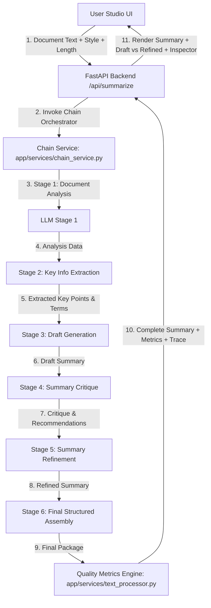

#### Component Breakdown
- **Text Processor (`services/text_processor.py`)**: Computes word counts, compression ratios, and vocabulary metrics.
- **LLM Provider (`services/llm_service.py`)**: Contains individual prompt templates for all 6 stages.
- **Chain Orchestrator (`services/chain_service.py`)**: Executes sequential pipeline and measures stage latencies.

### H. Experiment 03 Complete Workflow

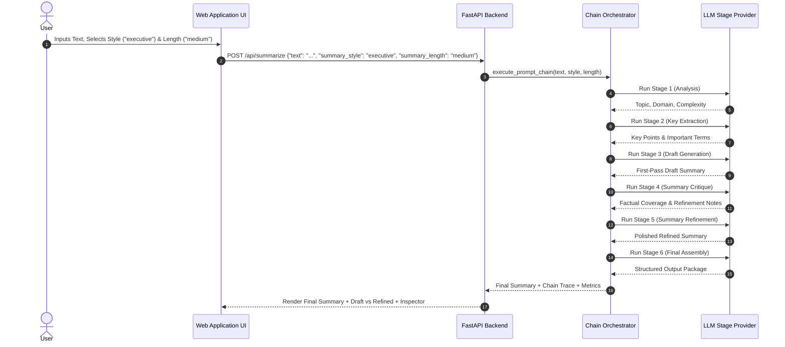

### I. Experiment 03 Internal Data Flow
1. **Input**: User pastes 800-word article on Cloud Architecture. Selects `Executive Summary` style, `Medium` length.
2. **Stage 1 (Analysis)**: Identifies domain (*Cloud Computing*), complexity (*Intermediate*).
3. **Stage 2 (Extraction)**: Extracts core architectural principles and key terms.
4. **Stage 3 (Draft)**: Generates initial draft summary.
5. **Stage 4 (Critique)**: Evaluates draft coverage (Example from verified run: `85%`), noting missing cost-optimization detail.
6. **Stage 5 (Refinement)**: Rewrites summary incorporating missing cost-optimization detail.
7. **Stage 6 (Final Package)**: Assembles executive summary package with metrics.

### J. Experiment 03 Folder Structure

```
experiment-03-prompt-chaining/
├── README.md                           # Lab Report & Documentation
├── requirements.txt                    # Project Dependencies
├── app/
│   ├── main.py                         # FastAPI Server Entry Point & Router
│   ├── config.py                       # Studio Settings
│   ├── schemas.py                      # Pydantic Schemas (SummarizeRequest, SummarizeResponse)
│   ├── services/
│   │   ├── text_processor.py           # Text Processing & Quality Metrics Engine
│   │   ├── llm_service.py              # 6-Stage Prompt Generators
│   │   └── chain_service.py            # Sequential Chain Orchestrator
│   └── static/                         # Studio Workspace UI (index.html, style.css, script.js)
├── tests/                              # 17 Automated Unit & Integration Tests
└── screenshots/                        # 5 Verification Screenshots & README
```

### K. Experiment 03 Technology Stack

| Technology | Purpose | Where Used |
| :--- | :--- | :--- |
| **Python 3.10+** | Programming Language | Core Pipeline Services |
| **FastAPI / Uvicorn** | Web Framework | `app/main.py` |
| **Pydantic v2** | Data Validation & Schemas | `app/schemas.py` |
| **Vanilla HTML5/CSS/JS** | Glassmorphic Interface | `app/static/*` |

### L. Experiment 03 Installation
```powershell
cd "D:\Agentic AI Experiments\experiment-03-prompt-chaining"
python -m venv venv
.\venv\Scripts\activate
pip install -r requirements.txt
Copy-Item .env.example .env
```

### M. Experiment 03 Exact Execution Procedure
```powershell
.\venv\Scripts\activate
python -m app.main
```
#### Exact Browser URL
👉 **`http://127.0.0.1:8002`**

### N. How to Use the UI
1. **Document Input Textarea:** Paste raw text to summarize (min 30 chars, max 15,000 chars).
2. **Control Bar Options:**
   - **Summary Style Dropdown:** `Executive Summary` (`executive`), `Concise Summary` (`concise`), `Detailed Summary` (`detailed`), `Bullet-Point Summary` (`bullet`), `Academic Abstract` (`academic`). Default: `Executive Summary`.
   - **Target Length Dropdown:** `Short` (`short`), `Medium` (`medium`), `Long` (`long`). Default: `Medium`.
3. **Action Button:** Click *"Execute Prompt Chain"*.
4. **Step-by-Step Chain Progress Bar:** Highlights active execution across all 6 stages (Analysis → Key Extraction → Draft Summary → Critique → Refinement → Final Output).
5. **Final Output Panel:** Displays formatted final summary, key takeaway bullets, and technical terms glossary.
6. **Draft vs. Refined Comparison View:** Displays side-by-side comparison of Stage 3 Draft vs Stage 5 Refined summary.
7. **Chain Inspector & Metrics Panel:** Displays latency per stage and quality metrics (Compression Ratio, Key Points Extracted, Processing Time).

### O. Experiment 03 Demonstration Procedure
1. Launch `python -m app.main` and open `http://127.0.0.1:8002`.
2. Click sample input button *"Agentic AI"* or *"Incident Response"*.
3. Select Summary Style `Executive Summary`, Target Length `Medium`.
4. Click *"Execute Prompt Chain"*.
5. Point out live stage execution chips advancing 1 through 6.
6. Show Final Executive Summary and Key Bullet Points.
7. Switch to **Draft vs Refined Comparison View** to prove Stage 4 critique and Stage 5 refinement improved the output.
8. Expand **Prompt Chain Inspector** to display stage latencies and quality metrics.

### P. Sample Inputs
- Educational Sample: *Agentic AI Paradigms* (600 words)
- Educational Sample: *Cybersecurity Incident Response* (800 words)
- Educational Sample: *Zero Trust Network Security* (750 words)

### Q. Expected Outputs
- 6-Stage Chain Trace, Draft vs Refined Comparison, Quality Metrics (Example from verified run: `72% Compression`), and Final Structured Summary Package.

### R. Experiment 03 Screenshots

#### Screenshot 1 — Home Interface & Controls
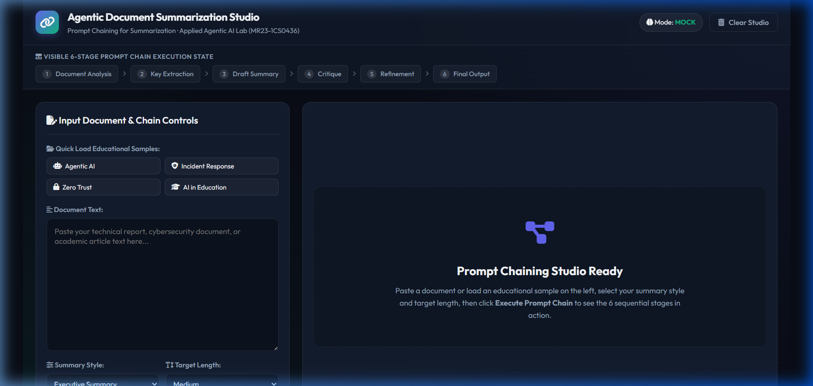
*Figure 3.1: Initial Web UI dashboard of the Agentic Document Summarization Studio showing document text area, quick-load sample buttons, summary style/length dropdowns, and visible 6-stage pipeline bar.*

#### Screenshot 2 — Prompt Chain Execution Progress

*Figure 3.2: Active execution of the 6-stage prompt chain pipeline bar as steps transition dynamically from in-progress to completed state.*

#### Screenshot 3 — Final Summary Result & Key Takeaways

*Figure 3.3: Stage 6 Final Refined Summary presentation card, quantitative metrics bar (Original Words, Final Words, Compression %, Processing Time), key points list, and important terms glossary.*

#### Screenshot 4 — Chain Inspector & Stage Latencies

*Figure 3.4: Collapsible Prompt Chain Inspector expanded to display per-stage execution timing (in ms), inputs consumed, and output previews for all 6 stages.*

#### Screenshot 5 — Draft vs Refined Summary Comparison

*Figure 3.5: Side-by-side comparison panel showing Stage 3 Draft Summary vs Stage 5 Refined Summary, proving how Stage 4 self-critique resolved coverage gaps and improved quality.*

---

### S. Experiment 03 Testing
Run automated test suite:
```powershell
python -m pytest tests
```
- **Verified Test Result:** `17 passed in 0.68s` (covers prompt stage propagation, summary styles, length configurations, quality metrics calculations, and API routes).

### T. Safety & Validation
- **Input Bounds:** Enforces input text length (min 30 chars, max 15,000 chars) to prevent API timeouts or memory overflow.
- **Format Integrity:** Stage 6 guarantees structured output fields are populated.

### U. Limitations
- **Sequential Latency:** Executing 6 sequential LLM calls incurs higher total execution time than a single-prompt call.

### V. Troubleshooting & Gotchas
- **`ModuleNotFoundError: No module named 'app'`**: Run **`python -m app.main`** from `experiment-03-prompt-chaining`.
- **Port Conflict (`8002`)**: Terminate running Python processes via `Stop-Process -Name "python" -Force`.

---

### W. Experiment 03 Viva Questions & Answers

1. **Q: Why use a 6-stage prompt chain instead of a single prompt for summarization?**
   *A:* Single prompts struggle with simultaneous analysis, extraction, drafting, critique, and styling. Chaining isolates responsibilities into specialized steps, enabling self-critique and higher quality.

2. **Q: What are the exact 6 stages of the prompt chain in Experiment 03?**
   *A:* Stage 1: Document Analysis, Stage 2: Key Information Extraction, Stage 3: Draft Summary Generation, Stage 4: Summary Critique, Stage 5: Summary Refinement, Stage 6: Final Structured Output Assembly.

3. **Q: What is the purpose of Stage 4 (Summary Critique)?**
   *A:* Stage 4 evaluates the Stage 3 draft against Stage 2 key points for factual coverage, redundancy, and style compliance, identifying specific recommendations for Stage 5 rewrite.

4. **Q: How is context propagated between stages in `chain_service.py`?**
   *A:* Each stage returns structured data, which is parsed and passed as explicit inputs to subsequent stage functions (e.g., Stage 5 consumes Stage 3 draft + Stage 4 critique + Stage 2 extracted key info).

5. **Q: What summary styles are supported by Experiment 03?**
   *A:* Five options: `Executive Summary` (`executive`), `Concise Summary` (`concise`), `Detailed Summary` (`detailed`), `Bullet-Point Summary` (`bullet`), `Academic Abstract` (`academic`).

6. **Q: What target lengths are supported by Experiment 03?**
   *A:* Three options: `Short` (`short`), `Medium` (`medium`), `Long` (`long`).

7. **Q: What quantitative metrics are computed by `text_processor.py`?**
   *A:* Original word count, final word count, compression ratio ($1 - \text{final}/\text{original}$), key points extracted count, important terms count, stages completed, and total processing time (ms).

8. **Q: What input document constraints are enforced by Pydantic?**
   *A:* `SummarizeRequest` in `app/schemas.py` enforces a minimum text length of 30 characters and a maximum text length of 15,000 characters.

9. **Q: How does the Draft vs Refined comparison view demonstrate agentic quality improvement?**
   *A:* It displays Stage 3 (raw draft) alongside Stage 5 (post-critique refined summary), visually proving to evaluators how the self-critique stage eliminated fluff and added missing key details.

10. **Q: What is the default server port for Experiment 03?**
    *A:* Port `8002` (accessed via `http://127.0.0.1:8002`).

---

### X. Conclusion
Experiment 03 demonstrates the power of sequential prompt chaining for complex text processing, proving that multi-stage draft-critique-refine workflows significantly improve output quality.

---

## 9. Comparison of Experiments 01–03

| Feature / Dimension | Experiment 01 — Text-to-SQL | Experiment 02 — Hybrid RAG QA | Experiment 03 — Prompt Chaining |
| :--- | :--- | :--- | :--- |
| **Primary Architectural Pattern** | Schema-Guided SQL Generation & Execution | Hybrid Vector+Lexical RAG Retrieval | 6-Stage Sequential Prompt Pipeline |
| **Input Type** | Natural Language Question | Natural Language Question | Raw Text Document (30 to 15k chars) |
| **External Knowledge Base** | SQLite Relational Database (`university.db`) | 9 Cybersecurity Markdown Documents | Input Text Document + User Parameters |
| **Retrieval Mechanism** | Relational Database Engine Queries | Hybrid Cosine Vector + Lexical Scoring | Direct Text Chunk Propagation |
| **Validation / Safeguards** | Lexical/Regex Read-Only SQL Security Validator | Relevance Threshold (`0.25`) & Out-of-KB Filter | Stage 4 Self-Critique & Length Guard |
| **Output Type** | Formatted SQL + Data Table + Summary | Grounded Natural Language Answer + Sources | Multi-Section Summary Package + Metrics |
| **Default Server Port** | `8000` | `8001` | `8002` |
| **Test Suite Results** | 8 Passed | 20 Passed | 17 Passed |
| **Core Learning Outcome** | Structured schema mapping & SQL safety | High-precision hybrid search & RAG grounding | Multi-stage context propagation & self-refinement |

---

## 10. Common Execution Guide

### Quick Command Reference

```powershell
# -----------------------------------------------------------------------------
# EXPERIMENT 01 — Text-to-SQL Workflow
# -----------------------------------------------------------------------------
cd "D:\Agentic AI Experiments\experiment-01-text-to-sql"
.\venv\Scripts\activate
python -m app.main
# Browser URL: http://127.0.0.1:8000

# -----------------------------------------------------------------------------
# EXPERIMENT 02 — RAG-Based Question Answering System
# -----------------------------------------------------------------------------
cd "D:\Agentic AI Experiments\experiment-02-rag-qa"
.\venv\Scripts\activate
python -m app.main
# Browser URL: http://127.0.0.1:8001

# -----------------------------------------------------------------------------
# EXPERIMENT 03 — Prompt Chaining for Summarization
# -----------------------------------------------------------------------------
cd "D:\Agentic AI Experiments\experiment-03-prompt-chaining"
.\venv\Scripts\activate
python -m app.main
# Browser URL: http://127.0.0.1:8002
```

---

## 11. Troubleshooting Guide

### 1. `ModuleNotFoundError: No module named 'app'`
- **Root Cause:** Executing `python app/main.py` directly without specifying the Python module execution flag (`-m`). Python cannot locate `app` on `sys.path`.
- **Solution:** Always execute applications using:
  ```powershell
  python -m app.main
  ```

### 2. `OSError: [Errno 10048] address already in use` (Port Conflict)
- **Root Cause:** Port 8000, 8001, or 8002 is already occupied by a previously running process.
- **Solution:** Terminate existing Python/Uvicorn processes:
  ```powershell
  Stop-Process -Name "python" -Force
  ```

### 3. Pytest Import Error (`No module named 'app'`)
- **Solution:** Run pytest from inside the target experiment directory:
  ```powershell
  cd "D:\Agentic AI Experiments\experiment-02-rag-qa"
  python -m pytest tests
  ```

---

## 12. Testing Guide

Run tests across all completed experiments:

```powershell
# Test Experiment 01
cd "D:\Agentic AI Experiments\experiment-01-text-to-sql"
python -m pytest tests

# Test Experiment 02
cd "D:\Agentic AI Experiments\experiment-02-rag-qa"
python -m pytest tests

# Test Experiment 03
cd "D:\Agentic AI Experiments\experiment-03-prompt-chaining"
python -m pytest tests
```

### Cumulative Test Results Summary
- **Experiment 01:** 8 / 8 Passed
- **Experiment 02:** 20 / 20 Passed
- **Experiment 03:** 17 / 17 Passed
- **Total Repository Tests:** 45 / 45 Passed

---

## 13. Git & GitHub Workflow

### Standard Commit Policy
Secrets (API keys, `.env` files) must **never** be committed to Git. `.gitignore` is configured to exclude `venv/`, `.env`, `__pycache__/`, and `.pytest_cache/`.

```powershell
# Standard publication sequence:
git status
git add .
git commit -m "docs: correct SQL validation terminology"
git push origin main
```

---

## 14. Faculty Demonstration Cheat Sheet

### If Faculty Asks to Evaluate Experiment 01 (Text-to-SQL):
1. Execute `cd experiment-01-text-to-sql; python -m app.main` and open `http://127.0.0.1:8000`.
2. Point out Schema Viewer on left panel showing SQLite tables (`departments`, `students`, `courses`, `enrollments`, `faculty`).
3. Click sample prompt *"Top 5 students by CGPA"*. Explain how schema context guided LLM SQL generation.
4. Click sample prompt *"DROP TABLE students;"*. Demonstrate Lexical SQL Security Validator blocking non-SELECT SQL.

### If Faculty Asks to Evaluate Experiment 02 (Hybrid RAG QA):
1. Execute `cd experiment-02-rag-qa; python -m app.main` and open `http://127.0.0.1:8001`.
2. Click chip *"What is SQL Injection?"*.
3. Point out source evidence card (`Web Application Security`) and expand RAG Inspector showing Hybrid Match score (Example: `0.5118`).
4. Click chip *"Explain MFA"* to demonstrate acronym unrolling.
5. Click chip *"What is the capital of France?"* to demonstrate out-of-KB threshold rejection (`0.1020 < 0.25`).

### If Faculty Asks to Evaluate Experiment 03 (Prompt Chaining):
1. Execute `cd experiment-03-prompt-chaining; python -m app.main` and open `http://127.0.0.1:8002`.
2. Paste sample text, select Style `Executive Summary`, and click *"Execute Prompt Chain"*.
3. Show 6 animated stage progress chips.
4. Show Final Executive Summary, Draft vs Refined comparison view, and Prompt Chain Inspector metrics.

---

## 15. Viva Preparation Guide

### Top Viva Questions Across Modules

1. **Q: What is the main difference between RAG (Exp 02) and Text-to-SQL (Exp 01)?**
   *A:* Text-to-SQL retrieves database schema to construct formal structured queries (`SELECT`), whereas RAG retrieves unstructured text passages from a vector store to ground natural language answers.

2. **Q: Why does Experiment 02 use Hybrid Retrieval instead of pure Vector Search?**
   *A:* Pure subword vector search suffered from false negatives on short acronyms (`SQLi`, `MFA`). Hybrid retrieval combines vector similarity ($50\%$) with term/phrase lexical matching ($50\%$), achieving high precision on domain queries while preserving safety against out-of-KB queries.

3. **Q: What is the advantage of Prompt Chaining (Exp 03) over single-prompt summarization?**
   *A:* Prompt chaining decomposes summarization into specialized stages (Analysis → Extraction → Draft → Critique → Refine → Package), enabling factual critique and iterative self-refinement.

---

## 16. Future Experiments Overview (04–12)

The repository will expand with the following upcoming modules:
- **Experiment 04 — SQL Agent with Tool Use:** ReAct reasoning loop with database tools and schema reflection.
- **Experiment 05 — Multi-Agent SDR System:** Multi-agent role-playing framework for outbound sales workflows.
- **Experiment 06 — Policy Compliance Agent:** Rule-based compliance evaluation agent.
- **Experiment 07 — Deep Research Agent:** Planning and reflection loops for automated research reports.
- **Experiment 08 — Visual QA & Image Retrieval:** Multimodal vision-language questioning system.
- **Experiment 09 — Reasoning Model Benchmarking:** Benchmarking reasoning strategies and Chain-of-Thought prompts.
- **Experiment 10 — Fine-Tuning for Domain Adaptation:** Parameter-efficient fine-tuning (LoRA/PEFT).
- **Experiment 11 — Model Optimization Experiment:** Model quantization (GGUF/AWQ) and distillation.
- **Experiment 12 — Capstone Mini Project:** Integrated enterprise multi-agent RAG ecosystem.

---

## 17. Master Guide Maintenance Policy

# Master Guide Maintenance Policy

> [!IMPORTANT]
> **`AGENTIC_AI_LAB_COMPLETE_GUIDE.md` is a mandatory living document.**
> Whenever any future experiment (**Experiments 04–12**) is implemented:
> 1. Complete implementation, automated testing, and browser verification.
> 2. Capture genuine screenshots into `screenshots/`.
> 3. Complete the experiment's local `README.md`.
> 4. **ADD FULL EXPERIMENT CHAPTER (Sections A–X) TO THIS MASTER GUIDE.**
> 5. Update the Experiment Status Matrix, test counts, and comparison sections.
> 6. Verify all relative links, commands, ports, and Mermaid diagrams.
> 7. Commit and push changes to GitHub.
>
> **An experiment MUST NOT be marked completed until this Master Guide has been updated.**
