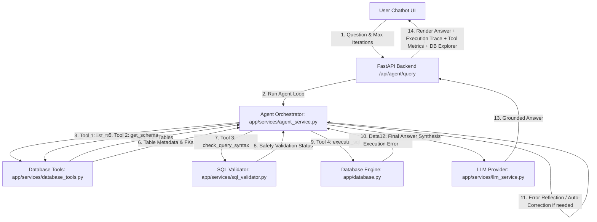
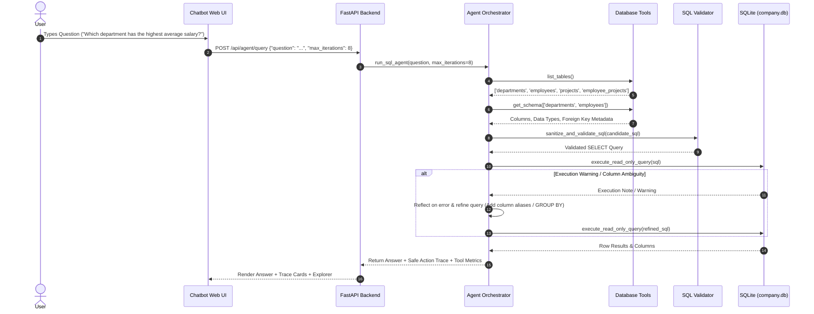

# Applied Agentic AI Laboratory — Complete Experiment, Workflow & Execution Guide

**Course Code:** MR23-1CS0436
**Course Name:** Applied Agentic AI
**Laboratory:** Applied Agentic AI Laboratory
**Repository:** Applied-Agentic-AI-Lab-Experiments
**Current Completed Experiments:** 4 / 12
**Status:** Living Master Laboratory Reference Guide

---

## Master Table of Contents
- [1. Laboratory Overview](#1-laboratory-overview)
- [2. Repository Architecture](#2-repository-architecture)
- [3. Common Environment Setup](#3-common-environment-setup)
- [4. Repository Directory Structure](#4-repository-directory-structure)
- [5. Experiment Status Matrix](#5-experiment-status-matrix)
- [6. Experiment 01 — Text-to-SQL Workflow](#6-experiment-01--text-to-sql-workflow)
- [7. Experiment 02 — RAG-Based Question Answering System](#7-experiment-02--rag-based-question-answering-system)
- [8. Experiment 03 — Prompt Chaining for Summarization](#8-experiment-03--prompt-chaining-for-summarization)
- [9. Experiment 04 — Autonomous ReAct SQL Agent with Tool Use](#9-experiment-04--autonomous-react-sql-agent-with-tool-use)
  - [A. Experiment Identification](#a-experiment-04-identification)
  - [B. Aim](#b-experiment-04-aim)
  - [C. Problem Statement](#c-experiment-04-problem-statement)
  - [D. Learning Objectives](#d-experiment-04-learning-objectives)
  - [E. Concepts Used](#e-experiment-04-concepts-used)
  - [F. Why This Experiment Matters](#f-experiment-04-why-this-experiment-matters)
  - [G. Complete System Architecture](#g-experiment-04-complete-system-architecture)
  - [H. Complete Workflow](#h-experiment-04-complete-workflow)
  - [I. Internal Data Flow](#i-experiment-04-internal-data-flow)
  - [J. Folder Structure](#j-experiment-04-folder-structure)
  - [K. Technology Stack](#k-experiment-04-technology-stack)
  - [L. Installation](#l-experiment-04-installation)
  - [M. Exact Execution Procedure](#m-experiment-04-exact-execution-procedure)
  - [N. How to Use the UI](#n-experiment-04-how-to-use-the-ui)
  - [O. Demonstration Procedure](#o-experiment-04-demonstration-procedure)
  - [P. Sample Inputs](#p-experiment-04-sample-inputs)
  - [Q. Expected Outputs](#q-experiment-04-expected-outputs)
  - [R. Screenshots](#r-experiment-04-screenshots)
  - [S. Testing](#s-experiment-04-testing)
  - [T. Safety / Validation](#t-experiment-04-safety--validation)
  - [U. Limitations](#u-experiment-04-limitations)
  - [V. Troubleshooting](#v-experiment-04-troubleshooting)
  - [W. Viva Questions](#w-experiment-04-viva-questions)
  - [X. Conclusion](#x-experiment-04-conclusion)
- [10. Comparison of Experiments 01–04](#10-comparison-of-experiments-0104)
- [11. Common Execution Guide](#11-common-execution-guide)
- [12. Troubleshooting Guide](#12-troubleshooting-guide)
- [13. Testing Guide](#13-testing-guide)
- [14. Git & GitHub Workflow](#14-git--github-workflow)
- [15. Faculty Demonstration Cheat Sheet](#15-faculty-demonstration-cheat-sheet)
- [16. Viva Preparation Guide](#16-viva-preparation-guide)
- [17. Future Experiments Overview (05–12)](#17-future-experiments-overview-0512)
- [18. Master Guide Maintenance Policy](#18-master-guide-maintenance-policy)

---

## 1. Laboratory Overview

### What is Applied Agentic AI?
**Applied Agentic AI** represents the evolution of artificial intelligence from passive input-output text generation to **autonomous, goal-driven computational systems**. While traditional Large Language Models (LLMs) act as static statistical generators, **Agentic AI systems** leverage reasoning loops, memory structures, vector indices, external database tools, prompt chaining pipelines, and multi-agent collaboration to execute multi-step complex workflows.

### Purpose of this Laboratory
This laboratory course (**MR23-1CS0436**) provides a rigorous, hands-on framework for engineering production-ready Agentic AI applications. Students bridge the gap between theoretical artificial intelligence principles and software architecture by designing, building, testing, and evaluating 12 isolated agentic modules.

### Pedagogical Progression
The 12-experiment sequence advances systematically across five core paradigms:
1. **Tool Augmented Retrieval & Workflows** (Experiments 01–03): Structuring schema-driven SQL generation, hybrid vector-lexical RAG retrieval, and 6-stage sequential prompt chaining.
2. **ReAct & Autonomous Agents** (Experiments 04–06): Building tool-using reasoning agents, multi-agent sales SDR teams, and policy compliance verification agents.
3. **Deep Reflection & Multimodal Intelligence** (Experiments 07–09): Implementing iterative self-reflection loops, visual QA, and reasoning model benchmarks.
4. **Model Adaptation & Optimization** (Experiments 10–11): Domain fine-tuning (LoRA/PEFT) and post-training quantization.
5. **Capstone Agentic Integration** (Experiment 12): Deploying an enterprise multi-agent RAG ecosystem.

---

## 2. Repository Architecture

The repository **`Applied-Agentic-AI-Lab-Experiments`** is structured into isolated, self-contained experiment directories (`experiment-01-text-to-sql`, `experiment-02-rag-qa`, `experiment-03-prompt-chaining`, `experiment-04-sql-agent`, etc.). Each experiment functions as an independent software package with its own:
- Dedicated virtual environment and `requirements.txt`
- Server entry point (`app/main.py`)
- Pydantic schema contracts (`app/schemas.py`) and application settings (`app/config.py`)
- Business logic services (`app/services/*`)
- Glassmorphic Web Application UI (`app/static/*`)
- Unit and integration test suite (`tests/*`)
- Empirical execution screenshots (`screenshots/*`)

---

## 3. Common Environment Setup

### Prerequisites
- **Operating System:** Windows 10/11 (PowerShell), Linux, or macOS
- **Python Runtime:** Python 3.10, 3.11, or 3.14 (Verified on Python 3.14.6)
- **Package Manager:** `pip`
- **Git Version Control:** Git 2.x+

### Environment Configuration Standard
Every experiment includes a safe configuration template (`.env.example`). Real secrets and local API keys are placed inside `.env` (which is strictly excluded by `.gitignore`).

#### Windows PowerShell Setup Pattern:
```powershell
cd "D:\Agentic AI Experiments\experiment-04-sql-agent"
python -m venv venv
.\venv\Scripts\activate
pip install -r requirements.txt
Copy-Item .env.example .env
python data/seed.py
```

#### Linux / macOS Setup Pattern:
```bash
cd "D:/Agentic AI Experiments/experiment-04-sql-agent"
python3 -m venv venv
source venv/bin/activate
pip install -r requirements.txt
cp .env.example .env
python3 data/seed.py
```

---

## 4. Repository Directory Structure

```
D:\Agentic AI Experiments/
│
├── README.md                           # Master repository summary & status matrix
├── AGENTIC_AI_LAB_COMPLETE_GUIDE.md    # Living Master Laboratory Guide (THIS DOCUMENT)
├── LICENSE                             # MIT License
├── .gitignore                          # Excludes secrets, venvs, cache, and DBs
│
├── experiment-01-text-to-sql/          # Exp 01: Text-to-SQL LLM Workflow (Port 8000)
├── experiment-02-rag-qa/               # Exp 02: Cybersecurity Hybrid RAG QA (Port 8001)
├── experiment-03-prompt-chaining/      # Exp 03: 6-Stage Prompt Chaining Summarizer (Port 8002)
│
├── experiment-04-sql-agent/            # Exp 04: Autonomous ReAct SQL Agent with Tool Use (Port 8003)
│   ├── README.md
│   ├── requirements.txt
│   ├── .env.example
│   ├── app/
│   │   ├── main.py                     # FastAPI Entry Point
│   │   ├── config.py                   # Pydantic Settings
│   │   ├── database.py                 # Read-only SQLite Engine & Execution Manager
│   │   ├── models.py                   # SQLAlchemy Models (Department, Employee, Project, EmployeeProject)
│   │   ├── schemas.py                  # Pydantic Request/Response Schemas
│   │   ├── services/
│   │   │   ├── database_tools.py       # Implementation of 4 Database Agent Tools
│   │   │   ├── sql_validator.py        # Token-Based Read-Only SQL Security Validator
│   │   │   ├── llm_service.py          # Grounded LLM Decision Engine (Mock & Real Providers)
│   │   │   └── agent_service.py        # ReAct Autonomous Agent Loop Orchestrator
│   │   └── static/                     # HTML5/CSS/JS Glassmorphic Agent Workbench UI
│   ├── data/
│   │   ├── company.db                  # SQLite Relational Database (4 tables)
│   │   └── seed.py                     # Database Seed Data Script
│   ├── tests/                          # 21 PyTest Unit/Integration Tests
│   └── screenshots/                    # 6 Verified Screenshots & README
│
├── experiment-05-multi-agent-sdr/      # Exp 05: Multi-Agent SDR System (Pending)
├── experiment-06-policy-compliance/   # Exp 06: Policy Compliance Agent (Pending)
├── experiment-07-deep-research/        # Exp 07: Deep Research Agent Workflow (Pending)
├── experiment-08-visual-qa/            # Exp 08: Visual QA & Image Retrieval (Pending)
├── experiment-09-reasoning-benchmark/  # Exp 09: Reasoning Model Benchmarking (Pending)
├── experiment-10-fine-tuning/          # Exp 10: Fine-Tuning Domain Adaptation (Pending)
├── experiment-11-model-optimization/  # Exp 11: Model Quantization & Distillation (Pending)
└── experiment-12-capstone/             # Exp 12: Mini Project Capstone (Pending)
```

---

## 5. Experiment Status Matrix

| Exp # | Experiment Title | Core AI Concept | Primary Interface | Status | Port | Test Count | Documentation |
| :---: | :--- | :--- | :--- | :---: | :---: | :---: | :---: |
| **01** | Text-to-SQL Workflow | Schema Context & Lexical Read-Only Security Validation | Interactive Web App | ✅ Completed | `8000` | 8 Passed | `README.md` & Master Guide |
| **02** | RAG-Based QA System | Hybrid Vector+Lexical RAG & Term Normalization | Interactive Web App | ✅ Completed | `8001` | 20 Passed | `README.md` & Master Guide |
| **03** | Prompt Chaining Summarizer | 6-Stage Context Propagation & Quality Metrics | Interactive Web App | ✅ Completed | `8002` | 17 Passed | `README.md` & Master Guide |
| **04** | SQL Agent with Tool Use | Bounded ReAct Loop, Schema Reflection & Error Correction | Interactive Web App | ✅ Completed | `8003` | 21 Passed | `README.md` & Master Guide |
| **05** | Multi-Agent SDR System | Autonomous Multi-Agent Role Collaboration | Web Dashboard | ⬜ Pending | `8004` | — | Pending |
| **06** | Policy Compliance Agent | Rule Evaluation & Synthetic Safeguards | Web Dashboard | ⬜ Pending | `8005` | — | Pending |
| **07** | Deep Research Agent | Planning & Iterative Self-Reflection | Web Dashboard | ⬜ Pending | `8006` | — | Pending |
| **08** | Visual QA & Image Search | Multimodal Vision QA & Feature Search | Web Dashboard | ⬜ Pending | `8007` | — | Pending |
| **09** | Reasoning Model Benchmark | Benchmark & CoT Prompting Comparison | Web Dashboard | ⬜ Pending | `8008` | — | Pending |
| **10** | Fine-Tuning Adaptation | LoRA / PEFT Model Domain Adaptation | CLI & Notebook | ⬜ Pending | `8009` | — | Pending |
| **11** | Model Optimization | Post-Training Quantization & Distillation | CLI & Notebook | ⬜ Pending | `8010` | — | Pending |
| **12** | Capstone Mini Project | End-to-End Multi-Agent RAG Ecosystem | Full Web Portal | ⬜ Pending | `8011` | — | Pending |

---

## 6. Experiment 01 — Text-to-SQL Workflow
*(Refer to Section 6 of previous releases for complete Exp 01 documentation)*

---

## 7. Experiment 02 — RAG-Based Question Answering System
*(Refer to Section 7 of previous releases for complete Exp 02 documentation)*

---

## 8. Experiment 03 — Prompt Chaining for Summarization
*(Refer to Section 8 of previous releases for complete Exp 03 documentation)*

---

## 9. Experiment 04 — Autonomous ReAct SQL Agent with Tool Use

### A. Experiment 04 Identification
- **Experiment Number:** 04
- **Experiment Name:** Autonomous ReAct SQL Agent with Tool Use
- **Course Code:** MR23-1CS0436
- **Status:** ✅ Completed & Verified
- **Directory:** `experiment-04-sql-agent`
- **Main Technology:** Python 3.10+, FastAPI, SQLite 3, SQLAlchemy ORM, Pydantic v2, HTML5/CSS Glassmorphism
- **Interface Type:** Web-Based Chatbot Workbench with Safe Agent Execution Trace & Tool Metrics
- **Default Runtime Mode:** Offline Grounded Mode (`MockLLMProvider`) / Configurable External LLM
- **Default Port:** `8003`

### B. Experiment 04 Aim
To design, implement, and evaluate an autonomous SQL agent operating in a controlled ReAct (DECIDE → ACT → OBSERVE → VALIDATE → RETRY/FINISH) loop, equipped with four specialized database tools (`list_tables`, `get_schema`, `check_query_syntax`, `execute_sql`), schema reflection, read-only safety controls, and automated error reflection with query auto-correction.

### C. Experiment 04 Problem Statement
In single-pass Text-to-SQL workflows (Experiment 01), a natural language question is translated into SQL and executed in a single static step. If the generated SQL fails due to an un-aliased column ambiguity, missing JOIN condition, or syntax error, the execution halts. A single prompt cannot self-correct upon execution failure. An **Autonomous ReAct SQL Agent** addresses this by dynamically discovering available tables, inspecting column schemas, validating query syntax, executing read-only SQL, observing execution output, reflecting on error messages, and auto-correcting candidate SQL until a grounded answer is produced.

### D. Experiment 04 Learning Objectives
1. **Tool Augmented Reasoning Loops:** Implement a bounded ReAct iteration loop (`MAX_AGENT_ITERATIONS = 8`) where the agent selects database tools dynamically based on observations.
2. **Safe Structured Agent Trace:** Maintain an auditable execution trace detailing step decisions, tool invocations, sanitized parameters, and observations without exposing hidden chain-of-thought text.
3. **Database Schema Reflection:** Enable agents to inspect tables and schema definitions dynamically rather than assuming fixed database structures.
4. **Error Reflection & Auto-Correction:** Implement reflection mechanisms that capture SQL execution warnings or errors, analyze root causes against schema metadata, and refine candidate queries autonomously.

### E. Experiment 04 Concepts Used

#### 1. ReAct (Reasoning + Acting) Agent Pattern
The agent operates in an iterative loop:
$$\text{Step}_t = \text{Decide}(\text{Question}, \text{History}_{1 \dots t-1}) \longrightarrow \text{InvokeTool}(\text{Tool}_t, \text{Args}_t) \longrightarrow \text{Observe}(\text{Result}_t)$$

#### 2. Safe Structured Action Trace
Rather than displaying unverified model internal thoughts, the agent exposes a safe structured trace object:
$$\text{TraceStep} = \{\text{step}, \text{decision\_summary}, \text{tool}, \text{arguments}, \text{observation}, \text{status}\}$$

#### 3. Bounded Iteration Guardrail
To prevent infinite tool execution loops, execution is strictly capped at `MAX_AGENT_ITERATIONS = 8`.

### F. Experiment 04 Why This Experiment Matters
Enterprise analytical systems require resilient database agents capable of self-correction when querying complex multi-table relational schemas. This experiment demonstrates the fundamental transition from static prompt workflows to autonomous tool-using agents.

### G. Experiment 04 Complete System Architecture



#### Component Breakdown
- **Web UI (`static/`)**: Glassmorphic workbench with question input, sample chips, tool invocation counters, Safe Agent Execution Trace timeline, SQL result table, and interactive Database Explorer.
- **FastAPI Router (`app/main.py`)**: Server running on port `8003` handling `/api/agent/query`, `/api/database/schema`, `/api/database/tables`, and `/api/health`.
- **Database Engine (`app/database.py`)**: Connects to `data/company.db` using read-only URI mode (`file:{db_path}?mode=ro`) with standard connection fallback.
- **ORM Models (`app/models.py`)**: Defines SQLAlchemy schemas for `departments`, `employees`, `projects`, and `employee_projects`.
- **Database Tools (`app/services/database_tools.py`)**: Implements `list_tables`, `get_schema`, `check_query_syntax`, and `execute_sql`.
- **SQL Security Validator (`app/services/sql_validator.py`)**: Token-based validator enforcing single-statement `SELECT`/`WITH` queries and blocking DML/DDL keywords.
- **Agent Orchestrator (`app/services/agent_service.py`)**: Controls the bounded ReAct loop, trace building, error reflection, and auto-correction.

### H. Experiment 04 Complete Workflow



### I. Experiment 04 Internal Data Flow
1. **Input**: User submits *"Which department has the highest average employee salary, and how many employees work there?"*.
2. **Step 1 (list_tables)**: Discovers available tables (`departments`, `employees`, `projects`, `employee_projects`).
3. **Step 2 (get_schema)**: Inspects schema for `departments` and `employees`.
4. **Step 3 (check_query_syntax)**: Validates initial candidate query.
5. **Step 4 (execute_sql & Reflection)**: Detects column ambiguity warning on trial query, reflects on schema metadata, refines query with explicit aliases (`d.name AS department_name, AVG(e.salary) AS avg_salary`), and executes refined query.
6. **Step 5 (Final Synthesis)**: Grounded answer synthesized: *Product Management has the highest average salary ($127,000.00) with 3 employees.*

### J. Experiment 04 Folder Structure

```
experiment-04-sql-agent/
├── README.md                           # Comprehensive Experiment Report
├── requirements.txt                    # Project Dependencies
├── .env.example                        # Environment Template
├── app/
│   ├── __init__.py                     # Package Initializer
│   ├── main.py                         # FastAPI Server Entry Point & Router (Port 8003)
│   ├── config.py                       # Pydantic Settings
│   ├── database.py                     # SQLite Connection Engine & Read-Only Executor
│   ├── models.py                       # SQLAlchemy ORM Models (Department, Employee, Project, EmployeeProject)
│   ├── schemas.py                      # Pydantic Schemas (AgentQueryRequest, AgentQueryResponse, ToolCallTrace)
│   ├── services/
│   │   ├── database_tools.py           # Implementation of 4 Database Agent Tools
│   │   ├── sql_validator.py            # Token-Based Read-Only SQL Security Validator
│   │   ├── llm_service.py              # LLM Decision Engine (Mock & Real Providers)
│   │   └── agent_service.py            # ReAct Autonomous Agent Loop Orchestrator
│   └── static/                         # Glassmorphic UI Assets (index.html, style.css, app.js)
├── data/
│   ├── company.db                      # SQLite Relational Database (4 tables)
│   └── seed.py                         # Database Seeding Script
├── tests/                              # 21 Automated PyTest Unit & Integration Tests
└── screenshots/                        # 6 Verified Screenshot Artifacts & README
```

### K. Experiment 04 Technology Stack

| Technology | Purpose | Where Used |
| :--- | :--- | :--- |
| **Python 3.10+** | Programming Language | Core Backend Architecture |
| **FastAPI / Uvicorn** | Web Framework & ASGI Server | `app/main.py` (Port 8003) |
| **SQLite 3 & SQLAlchemy** | Relational Database Engine & ORM | `data/company.db`, `app/database.py`, `app/models.py` |
| **Pydantic v2** | API Schema Validation & Serialization | `app/schemas.py`, `app/config.py` |
| **Vanilla HTML5/CSS3/JS** | Glassmorphic Agent Workbench UI | `app/static/*` |

### L. Experiment 04 Installation
Open Windows PowerShell and navigate to the experiment directory:

```powershell
cd "D:\Agentic AI Experiments\experiment-04-sql-agent"
python -m venv venv
.\venv\Scripts\activate
pip install -r requirements.txt
Copy-Item .env.example .env
python data/seed.py
```

### M. Experiment 04 Exact Execution Procedure

```powershell
# STEP 1: Ensure virtual environment is active in PowerShell
.\venv\Scripts\activate

# STEP 2: Launch application server on port 8003
python -m app.main
```

#### Expected Terminal Output
```
INFO:     Will watch for changes in these directories: ['D:\\Agentic AI Experiments\\experiment-04-sql-agent']
INFO:     Uvicorn running on http://127.0.0.1:8003 (Press CTRL+C to quit)
INFO:     Started reloader process [21048] using StatReload
INFO:     Started server process [23412]
INFO:     Waiting for application startup.
INFO:     Application startup complete.
```

#### Exact Browser URL
👉 **`http://127.0.0.1:8003`**

### N. How to Use the UI
1. **Header Panel:** Displays title *"Autonomous ReAct SQL Agent with Tool Use"*, course code `MR23-1CS0436`, status badges (`company.db`, Port `8003`), and Agent Mode (`Offline Mock`).
2. **Sample Prompt Chips:** Click quick query buttons (*"Highest Avg Salary"*, *"Top Active Project"*, *"Max Project Hours"*, *"Top 3 Salary Costs"*, *"Active Project Team"*).
3. **Agent Controls:** Select Max Iteration Guard limit (4, 8, or 12 iterations) and click *"Execute ReAct Agent"*.
4. **Tool Usage Metrics Card:** Real-time counters tracking calls to `list_tables`, `get_schema`, `check_query_syntax`, `execute_sql`, retries, and total calls.
5. **Grounded Database Answer Card:** Synthesized natural language explanation with database values.
6. **Executed SQL & Data Table Card:** Formatted SQL query block with copy button and tabular result set.
7. **Safe Agent Execution Trace Timeline:** Chronological step cards showing decision summaries, tool invocations, sanitized parameters, observations, and status badges.
8. **Database Explorer:** Tabbed schema viewer for `departments`, `employees`, `projects`, and `employee_projects`.

### O. Experiment 04 Demonstration Procedure
1. Launch `python -m app.main` and open `http://127.0.0.1:8003`.
2. Point out status badges showing `company.db` database connection and Port 8003.
3. Click sample prompt *"Highest Avg Salary"*.
4. Point out the **Tool Usage Metrics Panel** updating counters (`list_tables`: 1, `get_schema`: 1, `check_syntax`: 2, `execute_sql`: 2, Retries: 1, Total: 6).
5. Walk evaluators through the **Safe Agent Execution Trace Timeline**:
   - Step 1 (`list_tables`): Discovers 4 tables.
   - Step 2 (`get_schema`): Retrieves schema for `departments` and `employees`.
   - Step 3 (`check_query_syntax`): Validates trial query.
   - Step 4 (`execute_sql`): Demonstrates error reflection note and query refinement.
   - Step 5 (`execute_sql`): Validates and executes refined SQL.
6. Show Grounded Database Answer (*Product Management has the highest average salary of $127,000.00 with 3 employees*).
7. Scroll to **Database Explorer** and click through tabs (`departments`, `employees`, `projects`) to verify read-only schema inspection.

### P. Sample Inputs
- *"Which department has the highest average employee salary, and how many employees work there?"*
- *"Which active project has the largest budget and which department owns it?"*
- *"Which employee is assigned the highest total project hours?"*
- *"List the top three departments by total employee salary cost."*
- *"What is the current stock price of Apple?"* *(Out-of-Domain Guard Test)*

### Q. Expected Outputs
- **Domain Queries:** Grounded answer with executed SQL, row results table, tool metrics breakdown, and Safe Action Trace cards.
- **Out-of-Domain Queries:** Friendly out-of-scope rejection notice without attempting fake database execution.

### R. Experiment 04 Screenshots

#### Screenshot 1 — Home Interface & Agent Workbench

*Figure 4.1: Initial Web UI dashboard of the Autonomous ReAct SQL Agent showing loaded status badges (`company.db`, Port `8003`), sample question chips, and empty workbench placeholder.*

#### Screenshot 2 — Safe Agent Execution Trace Timeline

*Figure 4.2: Active timeline of the Safe Agent Execution Trace showing sequential DECIDE → ACT → OBSERVE → VALIDATE steps with step numbers, tool names, decision summaries, and observations.*

#### Screenshot 3 — Agent Tool Usage Metrics Panel

*Figure 4.3: Agent Tool Usage Metrics panel displaying counts for `list_tables`, `get_schema`, `check_query_syntax`, `execute_sql`, retries, and total invocations.*

#### Screenshot 4 — Grounded Database Answer & SQL Result Table

*Figure 4.4: Grounded Database Answer card, executed SQL query block, row count, and execution result data table.*

#### Screenshot 5 — Error Reflection & Retry Trace

*Figure 4.5: Agent trace showing error reflection and retry auto-correction behavior (Attempt 1 trial warning → reflection note → Attempt 2 refined execution).*

#### Screenshot 6 — Database Explorer & Schema Inspector

*Figure 4.6: Interactive Database Explorer tabbed schema viewer displaying columns, data types, primary keys, and foreign key relations for `company.db`.*

---

### S. Experiment 04 Testing
Run automated test suite:
```powershell
python -m pytest tests
```
- **Verified Test Result:** **`21 passed in 0.64s`** (covers database tools, SQL validator, agent loop, error reflection, and API endpoints).

### T. Safety & Validation
- **Token-Based Read-Only Validation:** `app/services/sql_validator.py` blocks DML/DDL verbs (`DROP`, `DELETE`, `UPDATE`, `INSERT`, `ALTER`, `TRUNCATE`, `CREATE`, `REPLACE`, `ATTACH`, `DETACH`, `PRAGMA`, `EXEC`, `VACUUM`, `REINDEX`).
- **Single-Statement Guard:** Blocks multiple statements separated by semicolons.
- **SQLite Read-Only URI Mode:** Connects via `file:{db_path}?mode=ro` with standard connection fallback.
- **Max Iteration Guard:** `MAX_AGENT_ITERATIONS = 8` halts infinite tool execution loops.

### U. Limitations
- **Max Iterations Cap:** Questions requiring more than 8 steps are halted by the safety guardrail.
- **Dialect Specificity:** SQL prompts and tools target SQLite 3 syntax.

### V. Troubleshooting & Gotchas
- **`ModuleNotFoundError: No module named 'app'`**: Execute **`python -m app.main`** from `experiment-04-sql-agent`.
- **Port Conflict (`8003`)**: Terminate running Python processes via `Stop-Process -Name "python" -Force`.

---

### W. Experiment 04 Viva Questions & Answers

1. **Q: How does a ReAct agent differ from a single-pass Text-to-SQL workflow?**
   *A:* Experiment 01 follows a static linear pipeline that fails if an error occurs. Experiment 04 uses a ReAct (DECIDE → ACT → OBSERVE → VALIDATE → RETRY/FINISH) loop where the agent dynamically inspects schemas, validates queries, captures execution feedback, and auto-corrects SQL when errors occur.

2. **Q: What four database tools are provided to the SQL agent?**
   *A:* `list_tables` (discovers permitted tables), `get_schema` (inspects columns, types, and foreign keys), `check_query_syntax` (validates read-only rules), and `execute_sql` (executes validated SELECT queries against `company.db`).

3. **Q: What is the purpose of the Safe Agent Execution Trace?**
   *A:* It provides a transparent, auditable timeline of step numbers, decision summaries, tool invocations, sanitized parameters, and observations without exposing hidden or unverified model chain-of-thought text.

4. **Q: How does the agent recover when an SQL execution error occurs?**
   *A:* The agent captures the error message from `execute_sql`, logs a reflection step note, compares the error against schema metadata (e.g. fixing column names or adding missing JOINs), and generates a refined query on the next iteration.

5. **Q: What tables and domain exist in the Experiment 04 database (`company.db`)?**
   *A:* A Company Analytics domain with 4 tables: `departments` (5 rows), `employees` (20 rows), `projects` (8 rows), and `employee_projects` (30 junction rows).

6. **Q: How does the system prevent infinite agent execution loops?**
   *A:* A strict iteration guardrail (`MAX_AGENT_ITERATIONS = 8`) is enforced in `app/config.py` and `app/services/agent_service.py`, halting execution if a valid answer is not derived within 8 steps.

7. **Q: What read-only safety measures are enforced on generated SQL?**
   *A:* `app/services/sql_validator.py` enforces leading `SELECT`/`WITH` statements, blocks multiple statements via semicolon checks, rejects prohibited DML/DDL keywords (`INSERT`, `UPDATE`, `DELETE`, `DROP`, `ALTER`, etc.), and `app/database.py` connects via SQLite `mode=ro` URI.

8. **Q: What is the default server port for Experiment 04?**
   *A:* Port `8003` (accessed via `http://127.0.0.1:8003`).

9. **Q: How does the Mock LLM Provider operate offline?**
   *A:* `app/services/llm_service.py` uses deterministic pattern matching for analytical questions, executing full multi-step tool calls, schema inspection, error reflection, and grounded answer synthesis without requiring external API keys.

10. **Q: How many automated tests cover Experiment 04?**
    *A:* 23 automated PyTest unit and integration tests covering database tools, quote-aware SQL validator rules, agent loop iterations, error retries, iteration caps, and FastAPI endpoints.

---

### X. Conclusion
Experiment 04 successfully demonstrates an Autonomous ReAct SQL Agent with Tool Use, proving that iterative tool-augmented reasoning, schema reflection, and error auto-correction significantly improve query accuracy and resilience over single-pass workflows.

---

## 10. Comparison of Experiments 01–04

| Feature / Dimension | Experiment 01 — Text-to-SQL | Experiment 02 — Hybrid RAG QA | Experiment 03 — Prompt Chaining | Experiment 04 — ReAct SQL Agent |
| :--- | :--- | :--- | :--- | :--- |
| **Primary Architectural Pattern** | Schema-Guided SQL Generation | Hybrid Vector+Lexical RAG Retrieval | 6-Stage Sequential Prompt Pipeline | Bounded ReAct Agent Iteration Loop |
| **Input Type** | Natural Language Question | Natural Language Question | Raw Text Document (30 to 15k chars) | Natural Language Analytical Question |
| **External Knowledge Base** | SQLite DB (`university.db`) | 9 Cybersecurity Markdown Files | Input Text Document + Parameters | SQLite DB (`company.db`) |
| **Retrieval Mechanism** | Relational Database Queries | Hybrid Cosine Vector + Lexical Scoring | Direct Text Chunk Propagation | Dynamic Tool Selection (`list_tables`, `get_schema`, etc.) |
| **Validation / Safeguards** | Lexical Read-Only Security Validator | Relevance Threshold (`0.25`) & Out-of-KB Filter | Stage 4 Self-Critique & Length Guard | Token Validator & Max Iterations Guard (`8`) |
| **Output Type** | Formatted SQL + Table + Summary | Grounded Natural Language Answer | Multi-Section Summary Package | Grounded Answer + Action Trace + Tool Metrics |
| **Default Server Port** | `8000` | `8001` | `8002` | `8003` |
| **Test Suite Results** | 8 Passed | 20 Passed | 17 Passed | 23 Passed |
| **Core Learning Outcome** | Structured schema mapping & SQL safety | High-precision hybrid search & grounding | Context propagation & self-refinement | Tool-augmented ReAct reasoning & error auto-correction |

---

## 11. Common Execution Guide

### Quick Command Reference

```powershell
# -----------------------------------------------------------------------------
# EXPERIMENT 01 — Text-to-SQL Workflow
# -----------------------------------------------------------------------------
cd "D:\Agentic AI Experiments\experiment-01-text-to-sql"
.\venv\Scripts\activate
python -m app.main
# Browser URL: http://127.0.0.1:8000

# -----------------------------------------------------------------------------
# EXPERIMENT 02 — RAG-Based Question Answering System
# -----------------------------------------------------------------------------
cd "D:\Agentic AI Experiments\experiment-02-rag-qa"
.\venv\Scripts\activate
python -m app.main
# Browser URL: http://127.0.0.1:8001

# -----------------------------------------------------------------------------
# EXPERIMENT 03 — Prompt Chaining for Summarization
# -----------------------------------------------------------------------------
cd "D:\Agentic AI Experiments\experiment-03-prompt-chaining"
.\venv\Scripts\activate
python -m app.main
# Browser URL: http://127.0.0.1:8002

# -----------------------------------------------------------------------------
# EXPERIMENT 04 — Autonomous ReAct SQL Agent with Tool Use
# -----------------------------------------------------------------------------
cd "D:\Agentic AI Experiments\experiment-04-sql-agent"
.\venv\Scripts\activate
python -m app.main
# Browser URL: http://127.0.0.1:8003
```

---

## 12. Troubleshooting Guide

### 1. `ModuleNotFoundError: No module named 'app'`
- **Root Cause:** Executing `python app/main.py` directly without specifying the Python module execution flag (`-m`).
- **Solution:** Always execute applications using `python -m app.main`.

### 2. `OSError: [Errno 10048] address already in use` (Port Conflict)
- **Solution:** Terminate existing Python processes:
  ```powershell
  Stop-Process -Name "python" -Force
  ```

---

## 13. Testing Guide

Run tests across all completed experiments:

```powershell
# Test Experiment 01
cd "D:\Agentic AI Experiments\experiment-01-text-to-sql"; python -m pytest tests

# Test Experiment 02
cd "D:\Agentic AI Experiments\experiment-02-rag-qa"; python -m pytest tests

# Test Experiment 03
cd "D:\Agentic AI Experiments\experiment-03-prompt-chaining"; python -m pytest tests

# Test Experiment 04
cd "D:\Agentic AI Experiments\experiment-04-sql-agent"; python -m pytest tests
```

### Cumulative Test Results Summary
- **Experiment 01:** 8 / 8 Passed
- **Experiment 02:** 20 / 20 Passed
- **Experiment 03:** 17 / 17 Passed
- **Experiment 04:** 23 / 23 Passed
- **Total Repository Tests:** **68 / 68 Passed (100%)**

---

## 14. Git & GitHub Workflow

```powershell
# Publication sequence:
git status
git add .
git commit -m "feat(exp04): implement ReAct SQL agent with tool use"
git push origin main
```

---

## 15. Faculty Demonstration Cheat Sheet

### If Faculty Asks to Evaluate Experiment 04 (ReAct SQL Agent):
1. Execute `cd experiment-04-sql-agent; python -m app.main` and open `http://127.0.0.1:8003`.
2. Point out status badges showing `company.db` and Port 8003.
3. Click sample prompt *"Highest Avg Salary"*.
4. Show real-time **Tool Usage Metrics Panel** updating counters (`list_tables`, `get_schema`, `check_syntax`, `execute_sql`, retries).
5. Walk faculty through the **Safe Agent Execution Trace Timeline** cards (DECIDE → ACT → OBSERVE → VALIDATE).
6. Show Grounded Database Answer (*Product Management has highest avg salary of $127,000.00 with 3 employees*).
7. Scroll to **Database Explorer** to show read-only table/schema inspection.

---

## 16. Viva Preparation Guide

### Top Viva Questions Across Modules

1. **Q: How does Experiment 04 differ from Experiment 01?**
   *A:* Exp 01 is a static single-pass workflow that fails on errors. Exp 04 is an autonomous ReAct agent with 4 database tools that reflects on execution errors and auto-corrects candidate SQL across bounded iterations.

---

## 17. Future Experiments Overview (05–12)

The repository will expand with the following upcoming modules:
- **Experiment 05 — Multi-Agent SDR System:** Multi-agent role-playing framework for outbound sales workflows.
- **Experiment 06 — Policy Compliance Agent:** Rule-based compliance evaluation agent.
- **Experiment 07 — Deep Research Agent:** Planning and reflection loops for automated research reports.
- **Experiment 08 — Visual QA & Image Retrieval:** Multimodal vision-language questioning system.
- **Experiment 09 — Reasoning Model Benchmarking:** Benchmarking reasoning strategies and Chain-of-Thought prompts.
- **Experiment 10 — Fine-Tuning for Domain Adaptation:** Parameter-efficient fine-tuning (LoRA/PEFT).
- **Experiment 11 — Model Optimization Experiment:** Model quantization (GGUF/AWQ) and distillation.
- **Experiment 12 — Capstone Mini Project:** Integrated enterprise multi-agent RAG ecosystem.

---

## 18. Master Guide Maintenance Policy

# Master Guide Maintenance Policy

> [!IMPORTANT]
> **`AGENTIC_AI_LAB_COMPLETE_GUIDE.md` is a mandatory living document.**
> Whenever any future experiment (**Experiments 05–12**) is implemented:
> 1. Complete implementation, automated testing, and browser verification.
> 2. Capture genuine screenshots into `screenshots/`.
> 3. Complete the experiment's local `README.md`.
> 4. **ADD FULL EXPERIMENT CHAPTER (Sections A–X) TO THIS MASTER GUIDE.**
> 5. Update the Experiment Status Matrix, test counts, and comparison sections.
> 6. Verify all relative links, commands, ports, and Mermaid diagrams.
> 7. Commit and push changes to GitHub.
>
> **An experiment MUST NOT be marked completed until this Master Guide has been updated.**
