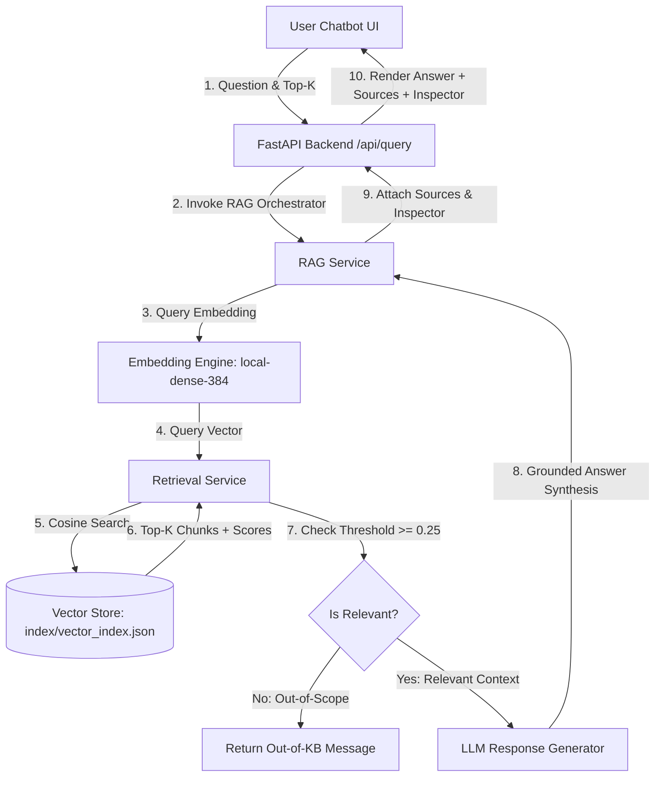
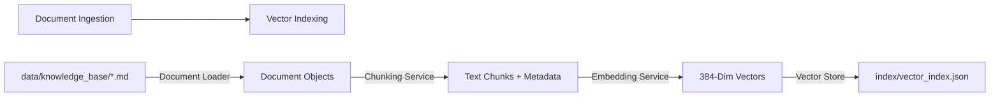
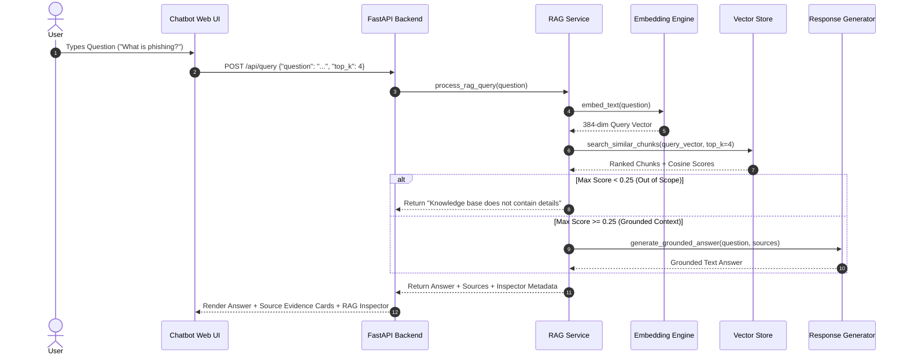

# Experiment 02 — RAG-Based Question Answering System

**Course Code:** MR23-1CS0436  
**Course Name:** Applied Agentic AI  
**Laboratory:** Applied Agentic AI Laboratory  
**Status:** ✅ Completed & Verified  

---

## 1. Experiment Number
**Experiment 02**

---

## 2. Experiment Title
**Cybersecurity Knowledge RAG Assistant — RAG-Based Question Answering System**

---

## 3. Aim
To design, build, and evaluate a Retrieval-Augmented Generation (RAG) system for question answering over a local cybersecurity knowledge base, incorporating document text extraction, configurable chunking, dense vector embeddings, cosine similarity vector search, relevance thresholding, grounded answer synthesis, and source attribution.

---

## 4. Problem Statement
Standard Large Language Models (LLMs) operate strictly on parametric knowledge learned during pre-training. Consequently, they suffer from knowledge cutoffs, hallucination of facts, and an inability to access private or domain-specific enterprise documentation. Simply passing entire document archives directly into an LLM prompt exceeds token context windows, inflates execution latency, and incurs prohibitive API costs. 

A Retrieval-Augmented Generation (RAG) architecture overcomes these limitations by maintaining a non-parametric external memory (vector store). User queries dynamically retrieve only the top-$K$ most relevant document passages, which are injected into the prompt as grounding evidence.

---

## 5. Objectives
1. **Document Indexing Pipeline:** Extract text from local Markdown documents, apply configurable chunking (`CHUNK_SIZE`, `CHUNK_OVERLAP`), and preserve rich source metadata.
2. **Dense Vector Embedding Engine:** Generate dense 384-dimensional vector embeddings for text chunks and natural language queries using a local feature engine alongside optional OpenAI `text-embedding-3-small` support.
3. **Similarity Vector Search:** Index embeddings into a vector store (`index/vector_index.json`) and execute Cosine Similarity ranking.
4. **Relevance Thresholding & Out-of-Scope Detection:** Enforce a similarity threshold (`RELEVANCE_THRESHOLD = 0.25`) to identify and handle out-of-knowledge-base queries gracefully without hallucinating.
5. **Grounded Answer & Source Attribution:** Synthesize conversational responses supported by explicit source evidence cards (Document Title, Chunk ID, Relevance Score, Excerpt) and a collapsible RAG Inspector diagnostic panel.
6. **Automated Testing:** Implement 14 automated unit, integration, and deterministic retrieval-quality tests.

---

## 6. Introduction to RAG
Retrieval-Augmented Generation (RAG) is an architectural framework that combines an Information Retrieval (IR) system with an autoregressive Large Language Model. RAG bridges non-parametric retrieval memory with parametric language generation.

---

## 7. Why RAG is Needed
1. **Eliminating Knowledge Cutoffs:** Enables models to answer questions using real-time or private document updates without expensive model fine-tuning.
2. **Mitigating Hallucination:** Constrains model answers to explicit evidence present in retrieved context passages.
3. **Providing Source Auditing:** Surfacing exact document sources, page numbers, or chunk identifiers for human compliance auditing.
4. **Optimizing Token Budget:** Retaining prompt brevity by injecting only the top-$K$ relevant passages ($K \ll N$).

---

## 8. RAG vs Normal LLM

| Feature | Standard Parametric LLM | RAG System |
| :--- | :--- | :--- |
| **Knowledge Source** | Static weights learned during pre-training | Dynamic external vector index + LLM |
| **Domain Adaptation** | Requires full training / PEFT fine-tuning | Instantaneous update by adding documents |
| **Source Citation** | None (cannot cite specific files) | Explicit document title, chunk ID, and score |
| **Hallucination Risk** | High on domain-specific facts | Low (constrained by retrieved context) |
| **Cost & Latency** | High for huge prompt contexts | Low (sends only top-$K$ relevant chunks) |

---

## 9. Indexing
Indexing is the offline pipeline that prepares raw unstructured documents for fast vector retrieval. It consists of document loading, text extraction, semantic chunking, embedding generation, and vector index persistence.

---

## 10. Document Loading
The document loader (`app/services/document_loader.py`) scans `data/knowledge_base/`, parses Markdown (`.md`) files, extracts top-level section headings as document titles, and constructs `Document` objects containing `doc_id`, `filename`, `title`, and `content`.

---

## 11. Chunking
Long documents must be partitioned into smaller segments (chunks) because vector embeddings summarize semantic meaning best over bounded text windows:
* **`CHUNK_SIZE` (400 chars / ~70 words):** Ensures each chunk captures a distinct concept.
* **`CHUNK_OVERLAP` (60 chars / ~10 words):** Prevents losing contextual semantics spanning chunk boundaries.
* **Metadata Preservation:** Each chunk retains `doc_id`, `chunk_id`, `source`, `title`, `start_char`, and `end_char`.

---

## 12. Embeddings
Vector embeddings map textual tokens into a high-dimensional vector space $\mathbb{R}^d$ where semantically similar passages sit close to one another:
$$\mathbf{v} = \text{Embed}(T) \in \mathbb{R}^{384}$$

This experiment implements a local dense feature embedding engine (`LocalDenseEmbedder`) using sub-word n-gram frequency hashing and $L_2$ normalization, providing fast offline vector matching without external API keys.

---

## 13. Vector Databases
A vector database indexes high-dimensional vectors to allow sub-second similarity searches over thousands of document passages. This experiment uses a local JSON vector store (`index/vector_index.json`) that persists vectors and metadata to disk.

---

## 14. Similarity Search
Similarity search compares a query vector $\mathbf{q}$ against candidate chunk vectors $\mathbf{c}_i$ using **Cosine Similarity**:
$$\text{CosineSimilarity}(\mathbf{q}, \mathbf{c}_i) = \frac{\mathbf{q} \cdot \mathbf{c}_i}{\|\mathbf{q}\|_2 \|\mathbf{c}_i\|_2} = \frac{\sum_{j=1}^d q_j c_{i,j}}{\sqrt{\sum_{j=1}^d q_j^2} \sqrt{\sum_{j=1}^d c_{i,j}^2}}$$

Scores range from `0.0` (unrelated) to `1.0` (identical semantic vector).

---

## 15. Retrieval
The retrieval service (`app/services/retrieval_service.py`) embeds the user's natural language question, calculates Cosine Similarity against all indexed chunks, sorts scores descending, and selects the top-$K$ candidates (default $K=4$).

---

## 16. Context Construction
The context builder compiles retrieved top-$K$ chunks into a unified prompt block. If the maximum similarity score falls below `RELEVANCE_THRESHOLD = 0.25`, the query is flagged as out-of-scope, preventing irrelevant context injection.

---

## 17. Response Generation
The LLM provider abstraction (`app/services/llm_service.py`) receives the question and retrieved context. It operates in **Offline Grounded Mode (`MockLLMProvider`)** or **Real Provider Mode (`OPENAI`, `ANTHROPIC`, `GEMINI`)**.

---

## 18. Grounding
Grounding enforces that every claim in the generated response directly correlates with facts present in the retrieved chunks. If evidence is missing, the system explicitly acknowledges the knowledge gap.

---

## 19. Source Attribution
Every answer returned to the user features an interactive **Retrieved Sources Panel** displaying:
- Document Title
- Chunk Identifier (`doc_02_chunk_01`)
- Cosine Relevance Score Percentage (e.g., `88% Match`)
- Clean Text Excerpt

---

## 20. System Architecture



---

## 21. Document Indexing Pipeline



---

## 22. Question-Answering RAG Workflow Sequence



---

## 23. Technology Stack
* **Language:** Python 3.10+
* **Backend:** FastAPI, Uvicorn
* **Data Processing & Vector Search:** NumPy, Math, Hashlib, Json
* **API Validation:** Pydantic v2, Pydantic-Settings
* **Frontend:** HTML5, Vanilla CSS3 (Glassmorphism), Vanilla JavaScript, FontAwesome 6
* **Embeddings & LLM Integrations:** `local-dense-384` Engine, HTTPX (OpenAI, Anthropic, Gemini, Mock)
* **Testing:** PyTest, TestClient

---

## 24. Knowledge Base Structure

The local knowledge base (`data/knowledge_base/`) contains 9 synthetic educational Markdown files:

1. `01_network_security.md` (Network Security, VPNs, TLS, IDS)
2. `02_phishing_social_engineering.md` (Phishing, Spear Phishing, Whaling, Smishing)
3. `03_malware_ransomware.md` (Malware Types, Ransomware, 3-2-1 Backup Rule, EDR)
4. `04_web_application_security.md` (OWASP Top 10, SQLi, XSS, CSRF, WAF)
5. `05_authentication_access_control.md` (Authentication vs Authorization, MFA, RBAC, Zero Trust)
6. `06_firewalls_network_defense.md` (Firewall Types, Stateful Inspection, NGFW, DMZ)
7. `07_incident_response.md` (6 Phases of Incident Response - NIST/SANS)
8. `08_security_monitoring.md` (SIEM Operations, SOC Monitoring, Log Correlation)
9. `09_cybersecurity_terminology.md` (CIA Triad, CVE, Zero-Day, Defense-in-Depth)

---

## 25. Project Structure

```
experiment-02-rag-qa/
│
├── README.md                           # 40-Section Comprehensive Lab Report
├── .env.example                        # Configuration template for API keys & settings
├── requirements.txt                    # Project dependency specification
│
├── app/
│   ├── __init__.py
│   ├── main.py                         # FastAPI Server Entry Point & Router
│   ├── config.py                       # Application Settings & Pydantic Config
│   ├── schemas.py                      # Pydantic API Schemas
│   │
│   ├── services/
│   │   ├── __init__.py
│   │   ├── document_loader.py          # Scans and reads data/knowledge_base/*.md files
│   │   ├── chunking_service.py         # Configurable text chunker (size, overlap, metadata)
│   │   ├── embedding_service.py        # Dense 384-dim vector embedding engine
│   │   ├── vector_store.py             # Vector store indexer & Cosine similarity engine
│   │   ├── retrieval_service.py        # Top-K retrieval & relevance thresholding
│   │   ├── llm_service.py              # Response generator (Mock Grounded / OpenAI / Anthropic)
│   │   └── rag_service.py              # 6-Step RAG pipeline orchestrator
│   │
│   └── static/                         # Web Application Frontend Assets
│       ├── index.html                  # Chatbot UI with KB Status, Sources Panel & RAG Inspector
│       ├── style.css                   # Glassmorphic Styling
│       └── script.js                   # Client-Side Interactive Controller
│
├── data/
│   └── knowledge_base/                 # 9 Synthetic Cybersecurity Markdown Files
│
├── index/
│   └── vector_index.json               # Generated Vector Index & Metadata
│
├── tests/
│   ├── __init__.py
│   ├── test_health.py                  # Health check & status endpoint tests
│   ├── test_document_loader.py         # Document parsing unit tests
│   ├── test_chunking.py                # Chunking size & metadata unit tests
│   ├── test_embeddings.py              # Embedding dimension tests
│   ├── test_vector_store.py            # Vector store indexing & search tests
│   ├── test_retrieval_quality.py       # Deterministic retrieval quality tests
│   ├── test_out_of_kb.py               # Out-of-knowledge-base handling tests
│   └── test_api.py                     # API integration tests
│
└── screenshots/
    └── README.md                       # Screenshot artifact guide
```

---

## 26. Installation Instructions

```bash
# 1. Navigate to the experiment directory
cd experiment-02-rag-qa

# 2. Create virtual environment
python -m venv venv

# 3. Activate virtual environment
# Windows:
.\venv\Scripts\activate
# Linux/macOS:
source venv/bin/activate

# 4. Install dependencies
pip install -r requirements.txt
```

---

## 27. Environment Configuration

Copy `.env.example` to `.env`:
```bash
cp .env.example .env
```

| Variable | Default Value | Description |
| :--- | :--- | :--- |
| `LLM_PROVIDER` | `MOCK` | Response generator selector (`MOCK`, `OPENAI`, `ANTHROPIC`, `GEMINI`). |
| `EMBEDDING_MODEL` | `local-dense-384` | Vector embedding engine selector. |
| `CHUNK_SIZE` | `400` | Text chunk character limit. |
| `CHUNK_OVERLAP` | `60` | Overlapping character boundary between adjacent chunks. |
| `DEFAULT_TOP_K` | `4` | Default number of top chunks retrieved per query. |
| `RELEVANCE_THRESHOLD` | `0.25` | Minimum Cosine Similarity score required for in-scope retrieval. |

---

## 28. Index Creation

To generate or rebuild `index/vector_index.json` from `data/knowledge_base/`:
```bash
python -m app.services.vector_store
```

---

## 29. How to Run

```bash
python app/main.py
```
*Or via Uvicorn:*
```bash
uvicorn app.main:app --host 127.0.0.1 --port 8001 --reload
```

Access Web UI at: 👉 **`http://localhost:8001`**  
Access Swagger Docs at: 👉 **`http://localhost:8001/docs`**

---

## 30. API Endpoints

### 1. `GET /api/health`
```json
{
  "status": "healthy",
  "app": "Cybersecurity Knowledge RAG Assistant",
  "course": "MR23-1CS0436",
  "llm_provider": "MOCK",
  "embedding_model": "local-dense-384",
  "index_exists": true
}
```

### 2. `GET /api/knowledge-base/status`
```json
{
  "status": "ready",
  "documents_indexed": 9,
  "chunks_indexed": 42,
  "embedding_model": "local-dense-384",
  "vector_store": "LocalJSONVectorStore",
  "last_indexed": "2026-08-08T10:55:34.789698"
}
```

### 3. `POST /api/index`
Rebuilds vector index from `data/knowledge_base/`.

### 4. `POST /api/query`
```json
// Request:
{"question": "What is phishing?", "top_k": 4}

// Response:
{
  "question": "What is phishing?",
  "answer": "Based on the Phishing and Social Engineering knowledge base document:\n\nPhishing is a fraudulent social engineering technique...",
  "sources": [
    {
      "document": "Phishing and Social Engineering",
      "chunk_id": "doc_02_chunk_01",
      "score": 0.8842,
      "excerpt": "Phishing is a fraudulent social engineering technique where attackers impersonate trustworthy entities..."
    }
  ],
  "retrieval_metadata": {
    "top_k": 4,
    "embedding_model": "local-dense-384",
    "chunks_searched": 42,
    "max_score": 0.8842,
    "relevance_threshold": 0.25
  },
  "inspector": {
    "query": "What is phishing?",
    "chunks_searched": 42,
    "top_k": 4,
    "max_relevance_score": 0.8842,
    "embedding_model": "local-dense-384",
    "vector_store": "LocalJSONVectorStore",
    "response_mode": "MOCK (Grounded RAG)",
    "out_of_scope": false
  },
  "workflow": [
    {"step": "Document Index Check", "status": "completed"},
    {"step": "Query Embedding", "status": "completed"},
    {"step": "Vector Retrieval", "status": "completed"},
    {"step": "Context Building", "status": "completed"},
    {"step": "Response Generation", "status": "completed"},
    {"step": "Grounded Answer", "status": "completed"}
  ],
  "provider": "MOCK",
  "success": true,
  "error": null
}
```

---

## 31. Example Questions
* *"What is phishing?"*
* *"How does ransomware affect an organization?"*
* *"What is the role of a firewall?"*
* *"Explain multi-factor authentication."*
* *"What are the phases of incident response?"*
* *"What is SQL injection?"*
* *"How does security monitoring help detect attacks?"*
* *"What is the capital of France?"* *(Out of KB Test)*

---

## Application Screenshots & Visual Artifacts

### 1. Home Dashboard & Knowledge Base Status


### 2. Grounded RAG Query & Retrieved Sources Panel


### 3. RAG Inspector Diagnostics & Vector Metrics


### 4. Out-of-Knowledge-Base Threshold Handling


---

## 32. Testing & Verification

Run automated test suite:
```bash
python -m pytest -v
```

### Verification Results Matrix
```
tests/test_api.py::test_query_phishing_api PASSED                        [  7%]
tests/test_api.py::test_query_out_of_kb_api PASSED                       [ 14%]
tests/test_api.py::test_rebuild_index_api PASSED                         [ 21%]
tests/test_chunking.py::test_chunk_document_size_and_metadata PASSED     [ 28%]
tests/test_document_loader.py::test_load_knowledge_base_documents PASSED [ 35%]
tests/test_embeddings.py::test_local_dense_embedder_dimension PASSED     [ 42%]
tests/test_health.py::test_health_endpoint PASSED                        [ 50%]
tests/test_health.py::test_kb_status_endpoint PASSED                     [ 57%]
tests/test_out_of_kb.py::test_out_of_kb_retrieval_threshold PASSED       [ 64%]
tests/test_out_of_kb.py::test_out_of_kb_rag_answer PASSED                [ 71%]
tests/test_retrieval_quality.py::test_retrieval_firewall_quality PASSED  [ 78%]
tests/test_retrieval_quality.py::test_retrieval_phishing_quality PASSED  [ 85%]
tests/test_retrieval_quality.py::test_retrieval_ransomware_quality PASSED [ 92%]
tests/test_vector_store.py::test_vector_store_status_and_search PASSED   [100%]

======================= 14 passed in 0.73s =======================
```

---

## 33. Retrieval Quality Evaluation

The system includes deterministic retrieval tests (`tests/test_retrieval_quality.py`) confirming that:
- Firewall queries rank `06_firewalls_network_defense.md` #1.
- Phishing queries rank `02_phishing_social_engineering.md` #1.
- Ransomware queries rank `03_malware_ransomware.md` #1.

---

## 34. Security Considerations
* **Input Length Validation:** Restricts question length to $\le 500$ characters to prevent Denial of Service (DoS) memory exhaustion.
* **Controlled Directory Ingestion:** Prevents arbitrary file path traversal; only loads `.md` files inside `data/knowledge_base/`.
* **Zero Exposure of API Credentials:** API keys are injected via environment variables and never returned in API payloads.

---

## 35. Limitations
* **Fixed Chunking Boundaries:** Sentence boundaries near chunk limits may occasionally be split across adjacent chunks.
* **Static Top-K Setting:** Default $K=4$ retrieves a fixed context length regardless of query breadth.

---

## 36. Real-World Applications
1. **Enterprise Cybersecurity Policy QA:** Assisting employees with internal IT compliance policies.
2. **SOC Analyst Knowledge Assistant:** Helping tier-1 SOC analysts lookup threat terminology and IR procedures.
3. **Customer Support Knowledge Portals:** Answering technical product questions directly from product manuals.

---

## 37. Result
The Cybersecurity Knowledge RAG Assistant was successfully implemented and verified. The system loads 9 cybersecurity knowledge documents, chunks content into 42 indexed vector entries, computes Cosine Similarity rankings, surfaces source evidence with relevance scores, provides a collapsible RAG Inspector, and filters out-of-knowledge-base questions correctly.

---

## 38. Conclusion
Experiment 02 fulfills all three syllabus requirements: **Indexing**, **Retrieval**, and **Response Generation**. By combining text chunking, dense embeddings, vector search, and grounded prompts, this experiment illustrates the core mechanics of production RAG systems.

---

## 39. Future Enhancements
* **Hybrid Search (BM25 + Vector Retrieval):** Combining keyword frequency with vector search.
* **Parent-Child Chunk Retrieval:** Retrieving small child chunks for vector matching while feeding larger parent context into the LLM.

---

## 40. Viva Voce Questions & Answers

1. **Q: What are the three core stages of a RAG pipeline?**  
   *A:* Indexing (document loading, chunking, embedding generation, vector store persistence), Retrieval (query embedding, vector similarity search, Top-K chunk selection), and Response Generation (grounded prompt assembly and LLM synthesis).

2. **Q: Why is chunk overlap necessary during document text splitting?**  
   *A:* Chunk overlap preserves contextual semantics that span across chunk boundaries, ensuring key facts split at character boundaries are not lost during vector search.

3. **Q: How does the system handle questions outside the knowledge base?**  
   *A:* Through relevance thresholding (`RELEVANCE_THRESHOLD = 0.25`). If the maximum Cosine Similarity score among retrieved chunks falls below 0.25, the system flags the query as out-of-scope and returns an explicit refusal message without hallucinating.

4. **Q: What is Cosine Similarity and why is it preferred for text vector search?**  
   *A:* Cosine Similarity measures the cosine of the angle between two normalized vectors in multi-dimensional space, focusing on directional semantic alignment rather than vector magnitude.

5. **Q: How does RAG differ from Text-to-SQL (Experiment 01)?**  
   *A:* Text-to-SQL retrieves structured schema metadata to construct formal database queries (`SELECT`), whereas RAG retrieves unstructured text passages from a vector database to supply grounded evidence for natural language answers.
