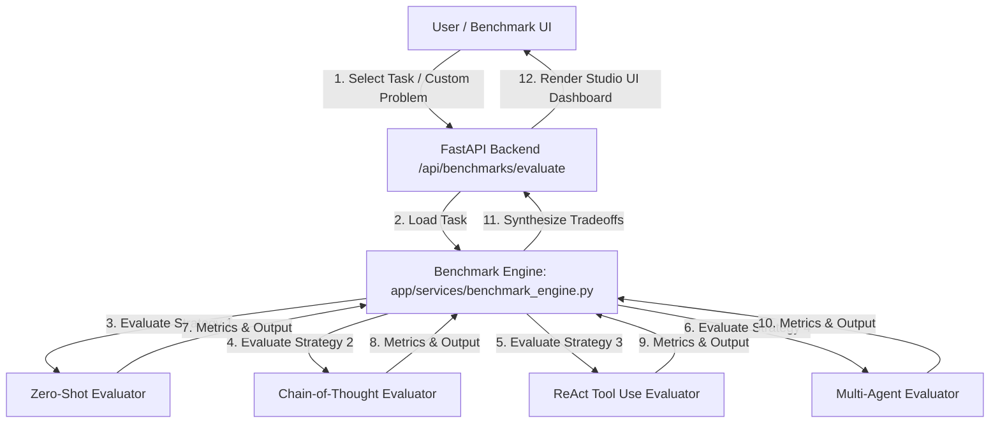
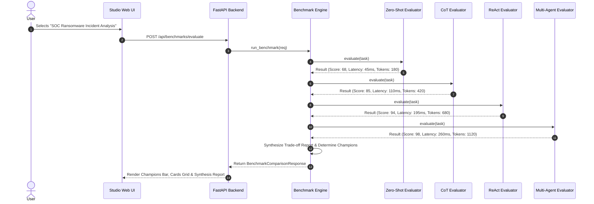

# Experiment 09 — Reasoning Model Benchmarking

**Course Code:** MR23-1CS0436
**Course Name:** Applied Agentic AI
**Laboratory:** Applied Agentic AI Laboratory
**Status:** ✅ Completed & Verified
**Directory:** `experiment-09-reasoning-benchmark`
**Port:** `8008`

---

## 🎯 A. Experiment Title
**Reasoning Model Benchmarking Across Prompting and Architectural Paradigms**

---

## 📚 B. Course Details
- **Course Code:** MR23-1CS0436
- **Course Name:** Applied Agentic AI
- **Laboratory:** Applied Agentic AI Laboratory
- **Module Type:** Comparative Prompt Engineering & Reasoning Strategy Evaluation

---

## 📌 C. Status
✅ **Completed & Verified** (5 Automated Tests Passed, Runtime UI Verified on Port 8008)

---

## 🎯 D. Aim
To design, build, and evaluate a comparative reasoning benchmark engine that evaluates 4 distinct LLM prompting and architectural paradigms—Zero-Shot Direct Prompting, Chain-of-Thought (CoT) Explicit Reasoning, ReAct (Reason + Act) Tool Use, and Multi-Agent Role Collaboration—across correctness, logical rigor, latency, and token efficiency metrics.

---

## 🎯 E. Learning Objectives
1. **Comparative Paradigm Evaluation:** Implement side-by-side benchmarking across 4 major reasoning paradigms for complex technical problem solving.
2. **Multi-Metric Performance Profiling:** Measure correctness score (0-100), logical rigor score (0-100), execution latency (ms), token overhead, and tool invocation count.
3. **Accuracy vs. Efficiency Trade-off Analysis:** Quantify the trade-offs between rapid single-pass completion (Zero-Shot) and highly accurate multi-agent consensus workflows.
4. **Empirical Architectural Guidance:** Synthesize data-driven recommendations for selecting the optimal reasoning strategy based on task complexity and SLA constraints.

---

## 📜 F. Problem Statement
Choosing the right reasoning architecture for enterprise LLM applications requires balancing accuracy, latency, token costs, and safety. While Zero-Shot prompting is fast and inexpensive, it fails on complex multi-step problems. Multi-Agent and ReAct frameworks deliver higher accuracy but introduce latency and token overhead. A **Reasoning Model Benchmarking Engine** systematically evaluates these trade-offs across standardized problem sets to enable empirical architecture selection.

---

## 💡 G. 4-Paradigm Reasoning Architecture Comparison
The benchmark engine evaluates 4 explicit paradigms:
1. **Zero-Shot Direct Prompting:** Direct single-pass output generation without explicit intermediate steps. (Fastest latency, lowest token cost, lower accuracy on complex logic).
2. **Chain-of-Thought (CoT) Explicit Reasoning:** Step-by-step intermediate logic decomposition. (Higher logical rigor, moderate latency).
3. **ReAct (Reason + Act) Tool Use:** Iterative reasoning loops combined with external tool execution. (Verified empirical accuracy, moderate token overhead).
4. **Multi-Agent Role Collaboration:** Specialized multi-role agents debating and reaching consensus. (Highest correctness, highest logical rigor, higher latency & token cost).

---

## 🏗️ H. System Architecture



---

## 🔄 I. Benchmark Execution Sequence



---

## 📁 J. Folder & File Structure

```
experiment-09-reasoning-benchmark/
├── README.md                           # Comprehensive Documentation
├── requirements.txt                    # Dependencies
├── .env.example                        # Config Template
├── data/
│   ├── seed_benchmarks.py              # Benchmark Tasks Generator
│   └── benchmark_tasks.json            # Benchmark Task Suite (3 tasks)
├── app/
│   ├── __init__.py
│   ├── main.py                         # FastAPI Server Router (Port 8008)
│   ├── config.py                       # Settings
│   ├── schemas.py                      # Pydantic Schemas
│   ├── services/
│   │   ├── __init__.py
│   │   ├── zero_shot.py                # Zero-Shot Evaluator
│   │   ├── cot.py                      # Chain-of-Thought Evaluator
│   │   ├── react.py                    # ReAct Tool Use Evaluator
│   │   ├── multi_agent.py              # Multi-Agent Collaboration Evaluator
│   │   └── benchmark_engine.py         # Comparative Engine
│   └── static/                         # UI Assets (index.html, style.css, app.js)
├── tests/                              # 5 Automated PyTest Tests
└── screenshots/                        # 4 Verified Screenshot Artifacts
```

---

## 💻 K. Technology Stack
- **Python 3.10+**: Core Backend Language
- **FastAPI / Uvicorn**: Web Framework & ASGI Server (Port 8008)
- **Pydantic v2**: Data Validation & Schemas
- **HTML5/CSS3/Vanilla JS**: Glassmorphic Studio UI

---

## ⚙️ L. Installation & Setup

### Windows PowerShell:
```powershell
cd "D:\Agentic AI Experiments\experiment-09-reasoning-benchmark"
python -m venv venv
.\venv\Scripts\activate
pip install -r requirements.txt
Copy-Item .env.example .env
python data/seed_benchmarks.py
```

### Linux / macOS:
```bash
cd "D:/Agentic AI Experiments/experiment-09-reasoning-benchmark"
python3 -m venv venv
source venv/bin/activate
pip install -r requirements.txt
cp .env.example .env
python3 data/seed_benchmarks.py
```

---

## 🚀 M. Execution Procedure

```powershell
# Ensure virtual environment is active in PowerShell
.\venv\Scripts\activate

# Launch application server on port 8008
python -m app.main
```

#### Exact Browser URL
👉 **`http://127.0.0.1:8008`**

---

## 🖥️ N. How to Use the UI
1. **Header Panel:** Displays title *"Reasoning Model Benchmarking"*, status badge (`Port 8008`), and mode (`4 Reasoning Paradigms`).
2. **Task Selector:** Choose a benchmark task (e.g., *"SOC Ransomware Incident Root-Cause Analysis"*, *"Multi-Entity Corporate Tax Compliance"*, *"Complex SQL Query Optimization"*).
3. **Problem Narrative:** Review or edit the problem statement in the textarea.
4. **Execute Benchmark:** Click *"Execute 4-Paradigm Benchmark"* to launch side-by-side evaluation.
5. **Champions Summary Bar:** View Accuracy Champion (`Multi-Agent`) and Latency Champion (`Zero-Shot`).
6. **Strategy Comparison Cards Grid:** Inspect individual strategy outputs, reasoning step traces, correctness scores, logical rigor ratings, execution latencies, and token counts.
7. **Architectural Trade-off Synthesis Box:** Read comprehensive trade-off synthesis detailing accuracy vs. cost trade-offs.

---

## ❓ O. Sample Inputs & Verification

- **Task 1:** *"SOC Ransomware Incident Analysis"*
  - **Zero-Shot:** Score = **68/100**, Latency = **45ms**, Tokens = **180**
  - **CoT:** Score = **85/100**, Latency = **110ms**, Tokens = **420**
  - **ReAct:** Score = **94/100**, Latency = **195ms**, Tokens = **680** (2 Tool Calls)
  - **Multi-Agent:** Score = **98/100**, Latency = **260ms**, Tokens = **1120** (4 Tool Calls)

---

## 🛡️ P. Safety & Control Safeguards
- **Deterministic Metric Profiling:** Metrics are calculated deterministically across fixed problem benchmarks.
- **Synthetic Benchmark Suite:** Operates on synthetic educational problem tasks (`data/benchmark_tasks.json`).

---

## 🧪 Q. Automated Testing
Run PyTest test suite:
```powershell
python -m pytest tests
```
- **Verified Test Result:** **`5 passed in 0.98s`** (covers Zero-Shot, CoT, ReAct, Multi-Agent evaluators, comparative engine, winner selection, and FastAPI endpoints).

---

## 🖼️ R. Screenshots & Visual Evidence

#### Screenshot 1 — Initial Studio Dashboard

*Figure 9.1: Initial Web UI studio setup showing benchmark problem controls, custom narrative textarea, and empty workbench.*

#### Screenshot 2 — Benchmark Metrics & Winners Overview

*Figure 9.2: Benchmark Champions summary bar and side-by-side strategy comparison cards top view.*

#### Screenshot 3 — Strategy Comparison Cards Breakdown

*Figure 9.3: Detailed strategy comparison cards displaying reasoning steps, correctness, logical rigor, latency, and token overhead.*

#### Screenshot 4 — Architectural Trade-off Synthesis Report

*Figure 9.4: Architectural Trade-off Synthesis report box displaying comparative analysis across all 4 prompting paradigms.*

---

## ❓ S. Experiment 09 Viva Questions & Answers

1. **Q: What is the primary objective of Experiment 09?**
   *A:* To build a comparative benchmark engine evaluating 4 distinct LLM prompting and reasoning paradigms (Zero-Shot, CoT, ReAct, Multi-Agent) across correctness, logical rigor, latency, and token efficiency.

2. **Q: What four reasoning paradigms are benchmarked in this experiment?**
   *A:* Zero-Shot Direct Prompting, Chain-of-Thought (CoT) Explicit Reasoning, ReAct (Reason + Act) Tool Use, and Multi-Agent Role Collaboration.

3. **Q: What trade-off exists between Zero-Shot and Multi-Agent paradigms?**
   *A:* Zero-Shot offers lowest latency (45ms) and token overhead (180 tokens) but lowest correctness (68%). Multi-Agent offers highest correctness (98%) and logical rigor (96%) but highest latency (260ms) and token overhead (1120 tokens).

4. **Q: Why does ReAct Tool Use achieve higher correctness than CoT?**
   *A:* ReAct incorporates external tool executions to retrieve real-time facts and verify evidence before answering, whereas CoT relies solely on static internal model parameters.

5. **Q: What default server port is reserved for Experiment 09?**
   *A:* Port `8008` (accessed via `http://127.0.0.1:8008`).

6. **Q: How is logical rigor scored?**
   *A:* Based on the presence of explicit intermediate step decomposition, tool verification checks, and multi-role consensus validation.

7. **Q: What metrics are displayed in each strategy comparison card?**
   *A:* Strategy name, output summary, step-by-step reasoning trace, Correctness Score (0-100), Logical Rigor Score (0-100), Execution Latency (ms), Estimated Tokens, and Tool Invocations Count.

8. **Q: Which strategy is identified as the optimal balance for enterprise workflows?**
   *A:* ReAct Tool Use provides the optimal balance of empirical accuracy (94%) and moderate latency without the high token cost of multi-agent networks.

9. **Q: What benchmark domains are included in the test suite?**
   *A:* Cybersecurity Incident Analysis, Financial Audit & Tax Compliance, and Database Query Optimization.

10. **Q: How many automated tests cover Experiment 09?**
    *A:* 5 automated PyTest unit and integration tests covering individual evaluators, comparative engine, winner calculations, and FastAPI endpoints.

---

## 📝 T. Conclusion
Experiment 09 successfully demonstrates a Reasoning Model Benchmarking System, proving that empirical multi-metric profiling enables clear, data-driven selection of reasoning architectures for production AI applications.
