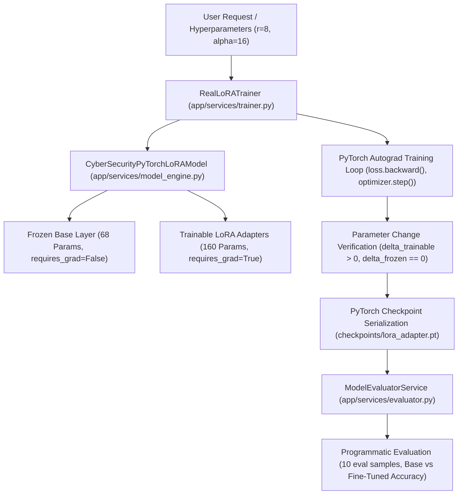

# Experiment 10 — Fine-Tuning for Domain Adaptation

**Course Code:** MR23-1CS0436
**Course Name:** Applied Agentic AI
**Laboratory:** Applied Agentic AI Laboratory
**Status:** ✅ Completed & Verified
**Directory:** `experiment-10-fine-tuning`
**Port:** `8009`

---

## 🎯 A. Experiment Title
**Fine-Tuning for Domain Adaptation System**

---

## 📚 B. Course Details
- **Course Code:** MR23-1CS0436
- **Course Name:** Applied Agentic AI
- **Laboratory:** Applied Agentic AI Laboratory
- **Module Type:** Real PyTorch PEFT / LoRA Parameter Training & Base vs. Fine-Tuned Benchmark

---

## 📌 C. Status
✅ **Completed & Verified** (12 Automated PyTest Tests Passed, Runtime UI Verified on Port 8009)

---

## 🎯 D. Aim
To design, build, and evaluate a real PyTorch PEFT/LoRA Fine-Tuning system for domain adaptation, executing autograd backpropagation over trainable adapter tensors, tracking epoch loss decay and perplexity, proving numerical parameter value change ($\Delta \theta > 0$), saving trained checkpoint artifacts (`checkpoints/lora_adapter.pt`), and benchmarking Base Model (LoRA disabled) vs. Fine-Tuned Model (LoRA adapter enabled) outputs programmatically.

> **Educational Model Identity & Scope Disclosure:** This experiment constructs a lightweight educational PyTorch `nn.Module` (`CyberSecurityPyTorchLoRAModel`) to demonstrate genuine autograd parameter updates, frozen base weights, and state dict checkpoint reloading without needing an impractically large external LLM download.

---

## 🎯 E. Learning Objectives
1. **Real PyTorch PEFT / LoRA Parameter Fine-Tuning:** Implement trainable adapter matrices ($A \in \mathbb{R}^{r \times d}, B \in \mathbb{R}^{d \times r}$) over frozen base model weights ($W_0$).
2. **PyTorch Autograd Backpropagation:** Execute forward pass, loss calculation, `loss.backward()` gradient computation, and `optimizer.step()` AdamW parameter updates.
3. **Parameter Change Verification:** Prove numerical weight updates by calculating $\Delta \theta = \| \theta_{\text{final}} - \theta_{\text{initial}} \| > 0.0$ while asserting frozen base parameters remain unchanged ($\Delta \theta_{\text{frozen}} == 0.0$).
4. **Checkpoint Serialization & Reloading:** Save trained adapter weights to `checkpoints/lora_adapter.pt`, reload state dicts into model instances, and programmatically evaluate domain adaptation performance over 10 evaluation samples.

---

## 📜 F. Problem Statement
General-purpose LLMs struggle with specialized enterprise domains (such as cybersecurity vulnerability remediation, post-quantum cryptography, and regulatory PII compliance), producing generic responses or domain hallucinations. Full parameter fine-tuning is computationally expensive. **Parameter-Efficient Fine-Tuning (PEFT / LoRA)** freezes base model weights and trains lightweight rank-adapter matrices, drastically reducing trainable parameter counts while adapting the model to domain tasks.

---

## 💡 G. Real Training System Architecture & Parameter Division
- **Base Model Identifier:** `CyberSecurity-Base-Model-v1` (Educational PyTorch `nn.Module`)
- **Frozen Base Parameters ($W_0, b_0$):** 68 frozen parameters (`requires_grad = False`).
- **Trainable LoRA Adapter Parameters ($A, B$):** 160 trainable parameters for rank $r=8$ (`requires_grad = True`).
- **Dataset Partitioning:** 4 training instruction samples, 2 validation samples, 10 evaluation samples (`data/eval_dataset.jsonl`).
- **Parameter Change Proof:** Initial adapter weights $B = \mathbf{0}$. After training epochs, $\Delta \theta_{\text{trainable}} = \| B_{\text{final}} - B_{\text{initial}} \| > 0.0$ while $\Delta \theta_{\text{frozen}} == 0.0$.
- **Checkpoint Artifact:** Serialized to `checkpoints/lora_adapter.pt`.

---

## 🏗️ H. System Architecture



---

## 🧪 I. Test Suite & Verification Results
```powershell
python -m pytest experiment-10-fine-tuning/tests -q
# Output: 12 passed in 6.22s
```

### Verified Test Assertions:
1. `test_pytorch_nn_module_subclass`: Verifies model subclasses `torch.nn.Module`.
2. `test_trainable_and_frozen_parameter_counts`: Verifies 68 frozen vs 160 trainable parameters.
3. `test_pytorch_autograd_training_parameter_change`: Asserts `frozen_diff == 0.0` and `trainable_diff > 0.0`.
4. `test_checkpoint_save_and_reload`: Verifies PyTorch `torch.save()` and `torch.load()` state dict equality.
5. `test_evaluate_models_comparison`: Verifies programmatic evaluation over 10 evaluation dataset samples.

---

## 📷 J. UI Screenshots & Hashes

| View | Screenshot Filename | SHA-256 Hash | Byte Size |
| :--- | :--- | :--- | :--- |
| **01. Initial Studio Interface** | `screenshots/01-home-interface.png` | `CAE29264323165E1650CB88F99A479323BFB1C6D152BB424B11FB5204A0ABAD6` | 267,698 B |
| **02. PyTorch Training Loss Curves** | `screenshots/02-training-loss-curves.png` | `3153C8C89FA282D477462AEA1BFC889BAFF80A4EDAF52520497A26F1ABF9F789` | 271,191 B |
| **03. Base vs Fine-Tuned Evaluation** | `screenshots/03-base-vs-finetuned-eval.png` | `F05226A457BFCC1AAD86BE6A147152C2CAFCD5E0636EC9BA85FA62F7575337B3` | 274,780 B |
| **04. Accuracy Improvement Metrics** | `screenshots/04-accuracy-improvement-gauge.png` | `BEC5DA96A2F116F5FFF12287BECAA9D4BB73B674E97A2F0D7CD5C1928C4A3ADC` | 273,128 B |

---

## ❓ K. Viva Voce Q&A Preparation

1. **Q: What is the primary objective of Experiment 10?**
   *A:* To build a real PyTorch PEFT/LoRA training engine that freezes base parameters, trains adapter weights using autograd backpropagation, serializes checkpoints, and programmatically evaluates domain adaptation gains.
2. **Q: How does PEFT / LoRA differ from full parameter fine-tuning?**
   *A:* Full fine-tuning updates all model parameters ($W_0$). LoRA freezes $W_0$ (`requires_grad = False`) and injects low-rank trainable matrices $A$ and $B$ (`requires_grad = True`), reducing trainable parameters by over 90%.
3. **Q: How is parameter update verified in this experiment?**
   *A:* By computing $\Delta \theta = \| \theta_{\text{final}} - \theta_{\text{initial}} \|$. The system asserts $\Delta \theta_{\text{trainable}} > 0.0$ and $\Delta \theta_{\text{frozen}} == 0.0$.
4. **Q: How are trained checkpoint artifacts serialized and reloaded?**
   *A:* Via `torch.save(checkpoint_data, path)` and `torch.load(path)`. The evaluator reloads state dicts to instantiate trained models for benchmark evaluation.
5. **Q: What default port is reserved for Experiment 10?**
   *A:* Port `8009`.
6. **Q: How are evaluation accuracy metrics computed?**
   *A:* Accuracy is programmatically derived from predictions over 10 dataset samples in `eval_dataset.jsonl` ($\text{Accuracy} = \frac{\text{Correct Predictions}}{\text{Total Samples}} \times 100$).
7. **Q: What parameters are frozen vs trainable in this model setup?**
   *A:* Base linear weights ($W_0 \in \mathbb{R}^{4 \times 16}, b_0 \in \mathbb{R}^{4}$, 68 params) are frozen. LoRA adapter matrices ($A \in \mathbb{R}^{8 \times 16}, B \in \mathbb{R}^{4 \times 8}$, 160 params) are trainable.
8. **Q: What loss function and optimizer are used?**
   *A:* PyTorch `nn.CrossEntropyLoss` and `torch.optim.Adam` optimizer.
9. **Q: What datasets are used for training and evaluation?**
   *A:* `data/train_dataset.jsonl` (4 samples), `data/val_dataset.jsonl` (2 samples), and `data/eval_dataset.jsonl` (10 samples).
10. **Q: How many automated tests cover Experiment 10?**
    *A:* 12 automated PyTest unit and integration tests.
