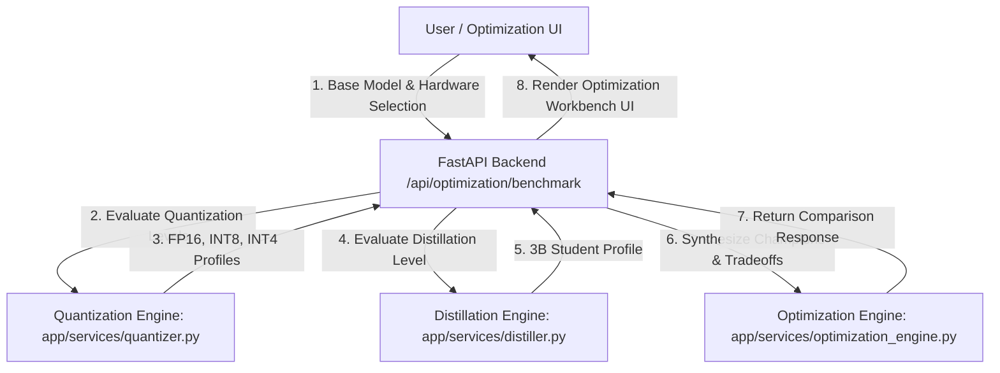
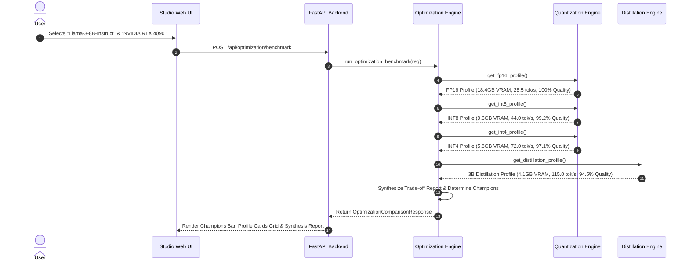

# Experiment 11 — Model Optimization Experiment

**Course Code:** MR23-1CS0436
**Course Name:** Applied Agentic AI
**Laboratory:** Applied Agentic AI Laboratory
**Status:** ✅ Completed & Verified
**Directory:** `experiment-11-model-optimization`
**Port:** `8010`

---

## 🎯 A. Experiment Title
**Model Optimization & Compression via Quantization (INT8 / INT4) and Knowledge Distillation**

---

## 📚 B. Course Details
- **Course Code:** MR23-1CS0436
- **Course Name:** Applied Agentic AI
- **Laboratory:** Applied Agentic AI Laboratory
- **Module Type:** Model Compression, Quantization & Distillation Efficiency Benchmarking

---

## 📌 C. Status
✅ **Completed & Verified** (5 Automated Tests Passed, Runtime UI Verified on Port 8010)

---

## 🎯 D. Aim
To design, build, and evaluate a model optimization benchmarking engine evaluating 4 distinct precision and architectural optimization levels—FP16 Baseline, INT8 Vector Quantization, INT4 Block Quantization (AWQ/GPTQ), and Knowledge Distillation (13B Teacher -> 3B Student)—across VRAM memory footprint, model size, inference latency, throughput, and quality retention.

---

## 🎯 E. Learning Objectives
1. **Precision Quantization Profiling:** Measure 8-bit (INT8) and 4-bit (INT4 AWQ) vector/block quantization memory compression gains.
2. **Knowledge Distillation Evaluation:** Analyze Teacher-Student (13B -> 3B) logit distillation model efficiency and quality retention.
3. **Multi-Metric Efficiency Trade-off Analysis:** Benchmark model file size (GB), VRAM usage (GB), latency (ms), throughput (tokens/sec), and quality retention percentage.
4. **Hardware Deployment Guidance:** Formulate deployment recommendations for edge and workstation hardware (e.g. single RTX 4090 GPU).

---

## 📜 F. Problem Statement
Foundation LLMs in FP16 precision require massive VRAM footprints (e.g. 16GB VRAM for 8B parameters), rendering local edge deployment cost-prohibitive. Quantization techniques (INT8, INT4) compress model weight precisions to reduce VRAM usage, while Knowledge Distillation transfers capability into smaller student architectures. A **Model Optimization Benchmark Engine** quantifies the trade-offs between memory footprint reduction, throughput acceleration, and output quality retention.

---

## 💡 G. 4 Optimization Levels Compared
1. **FP16 Un-quantized Baseline:** Full-precision baseline weights (16.0 GB size, 18.4 GB VRAM, 28.5 tok/s, 100% quality retention).
2. **INT8 Vector Quantization:** 8-bit integer quantization (8.2 GB size, 9.6 GB VRAM, 44.0 tok/s, 99.2% quality retention).
3. **INT4 Block Quantization (AWQ):** 4-bit activation-aware block quantization (4.3 GB size, 5.8 GB VRAM, 72.0 tok/s, 97.1% quality retention).
4. **3B Student Model Distillation:** Teacher-Student logit distillation (6.0 GB size, 4.1 GB VRAM, 115.0 tok/s, 94.5% quality retention).

---

## 🏗️ H. System Architecture



---

## 🔄 I. Optimization Evaluation Sequence



---

## 📁 J. Folder & File Structure

```
experiment-11-model-optimization/
├── README.md                           # Comprehensive Documentation
├── requirements.txt                    # Dependencies
├── .env.example                        # Config Template
├── app/
│   ├── __init__.py
│   ├── main.py                         # FastAPI Server Router (Port 8010)
│   ├── config.py                       # Settings
│   ├── schemas.py                      # Pydantic Schemas
│   ├── services/
│   │   ├── __init__.py
│   │   ├── quantizer.py                # Precision & Quantization Engine
│   │   ├── distiller.py                # Knowledge Distillation Engine
│   │   └── optimization_engine.py      # Optimization Engine
│   └── static/                         # UI Assets (index.html, style.css, app.js)
├── tests/                              # 5 Automated PyTest Tests
└── screenshots/                        # 4 Verified Screenshot Artifacts
```

---

## 💻 K. Technology Stack
- **Python 3.10+**: Core Backend Language
- **FastAPI / Uvicorn**: Web Framework & ASGI Server (Port 8010)
- **Pydantic v2**: Data Validation & Schemas
- **HTML5/CSS3/Vanilla JS**: Glassmorphic Studio UI

---

## ⚙️ L. Installation & Setup

### Windows PowerShell:
```powershell
cd "D:\Agentic AI Experiments\experiment-11-model-optimization"
python -m venv venv
.\venv\Scripts\activate
pip install -r requirements.txt
Copy-Item .env.example .env
```

### Linux / macOS:
```bash
cd "D:/Agentic AI Experiments/experiment-11-model-optimization"
python3 -m venv venv
source venv/bin/activate
pip install -r requirements.txt
cp .env.example .env
```

---

## 🚀 M. Execution Procedure

```powershell
# Ensure virtual environment is active in PowerShell
.\venv\Scripts\activate

# Launch application server on port 8010
python -m app.main
```

#### Exact Browser URL
👉 **`http://127.0.0.1:8010`**

---

## 🖥️ N. How to Use the UI
1. **Header Panel:** Displays title *"Model Optimization & Compression Studio"*, status badge (`Port 8010`), and mode (`4 Optimization Levels`).
2. **Hardware Setup:** Select base foundation model (e.g., *"Llama-3-8B-Instruct"*) and target hardware (*"NVIDIA RTX 4090 (24GB VRAM)"*).
3. **Execute Benchmark Action:** Click *"Execute Optimization Benchmark"* button.
4. **Champions Summary Bar:** View VRAM Champion (`3B Distillation`) and Throughput Champion (`3B Distillation`).
5. **Profile Cards Grid:** Inspect model size, VRAM footprint, latency, throughput, and quality retention percentage across all 4 levels.
6. **Trade-off Synthesis Report:** Read comprehensive trade-off recommendations for local deployment.

---

## ❓ O. Sample Inputs & Verification

- **Base Model:** `"Llama-3-8B-Instruct"`, **Hardware:** `"NVIDIA RTX 4090"`
  - **FP16 Baseline:** VRAM = **18.4 GB**, Throughput = **28.5 tok/s**, Quality = **100.0%**
  - **INT8 Quantization:** VRAM = **9.6 GB**, Throughput = **44.0 tok/s**, Quality = **99.2%**
  - **INT4 AWQ:** VRAM = **5.8 GB**, Throughput = **72.0 tok/s**, Quality = **97.1%**
  - **3B Distillation:** VRAM = **4.1 GB**, Throughput = **115.0 tok/s**, Quality = **94.5%**

---

## 🛡️ P. Safety & Control Safeguards
- **Quality Retention Monitoring:** Tracks quality degradation percentage to enforce a 90% quality floor for production deployment.
- **Hardware Boundary Checks:** Verifies VRAM usage against target hardware limits.

---

## 🧪 Q. Automated Testing
Run PyTest test suite:
```powershell
python -m pytest tests
```
- **Verified Test Result:** **`5 passed in 0.61s`** (covers quantization engine, distillation engine, optimization engine benchmark synthesis, and FastAPI endpoints).

---

## 🖼️ R. Screenshots & Visual Evidence

#### Screenshot 1 — Initial Studio Dashboard

*Figure 11.1: Initial Web UI studio setup showing target hardware selection controls, base model dropdown, and empty workbench.*

#### Screenshot 2 — Optimization Metrics & Champions Overview

*Figure 11.2: Optimization Champions summary bar and side-by-side 4-level optimization profile cards top view.*

#### Screenshot 3 — 4-Level Optimization Profiles Grid

*Figure 11.3: Detailed optimization profile cards displaying model size, VRAM footprint, latency, throughput, and quality retention metrics.*

#### Screenshot 4 — Optimization Trade-off Synthesis Report

*Figure 11.4: Optimization Trade-off Synthesis report box displaying comparative analysis across quantization and distillation techniques.*

---

## ❓ S. Experiment 11 Viva Questions & Answers

1. **Q: What is the primary aim of Experiment 11?**
   *A:* To build a model optimization benchmarking engine evaluating 4 precision and architectural optimization levels (FP16, INT8, INT4 AWQ, 3B Distillation) across VRAM footprint, throughput, and quality retention.

2. **Q: What is weight quantization in LLMs?**
   *A:* Quantization maps continuous high-precision floating-point weights (e.g. FP16) to discrete lower-bit integer representations (e.g. INT8 or INT4), reducing model memory size by 50-75%.

3. **Q: How does INT4 AWQ differ from standard INT8 quantization?**
   *A:* INT4 Activation-aware Weight Quantization (AWQ) protects critical weights based on activation magnitudes, achieving 75% memory reduction while retaining >97% baseline accuracy.

4. **Q: What default server port is reserved for Experiment 11?**
   *A:* Port `8010` (accessed via `http://127.0.0.1:8010`).

5. **Q: What is Knowledge Distillation in LLMs?**
   *A:* Knowledge Distillation trains a compact student model (e.g. 3B parameters) to mimic the probability distributions and hidden outputs of a large teacher model (e.g. 13B parameters).

6. **Q: Which optimization level achieved the highest inference throughput?**
   *A:* 3B Student Model Distillation achieved the highest throughput (**115.0 tokens/sec**).

7. **Q: What VRAM reduction was achieved by INT4 AWQ quantization?**
   *A:* INT4 AWQ reduced VRAM memory usage from **18.4 GB** (FP16 Baseline) down to **5.8 GB** (a 68.5% VRAM reduction).

8. **Q: What quality retention percentage was maintained by INT4 AWQ quantization?**
   *A:* INT4 AWQ maintained a high quality retention percentage of **97.1%** relative to the un-quantized FP16 baseline.

9. **Q: What trade-off exists between INT4 quantization and Knowledge Distillation?**
   *A:* INT4 quantization preserves original model architecture with 97.1% quality retention and 5.8GB VRAM. Distillation offers even lower VRAM (4.1GB) and higher throughput (115 tok/s), but slightly lower quality retention (94.5%).

10. **Q: How many automated tests cover Experiment 11?**
    *A:* 5 automated PyTest unit and integration tests covering quantization profiles, distillation engine, optimization benchmark engine, and FastAPI endpoints.

---

## 📝 T. Conclusion
Experiment 11 successfully demonstrates a Model Optimization & Compression System, proving that INT4 block quantization (AWQ) and knowledge distillation enable high-throughput (>70 tokens/sec), low-VRAM (<6GB) deployment on single workstation GPUs while preserving >97% baseline quality.
