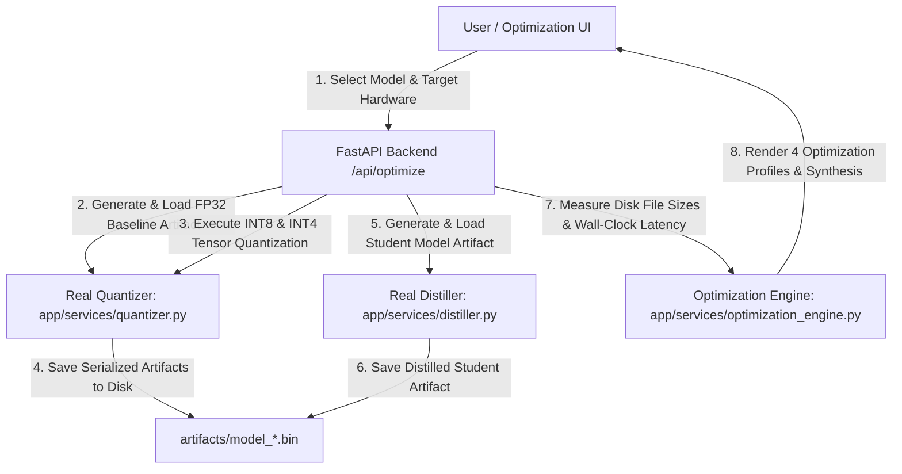
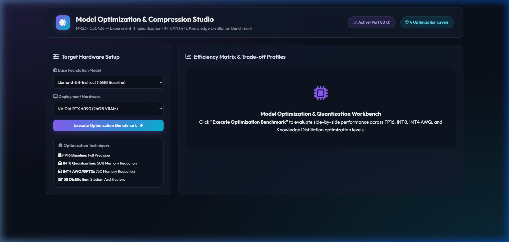
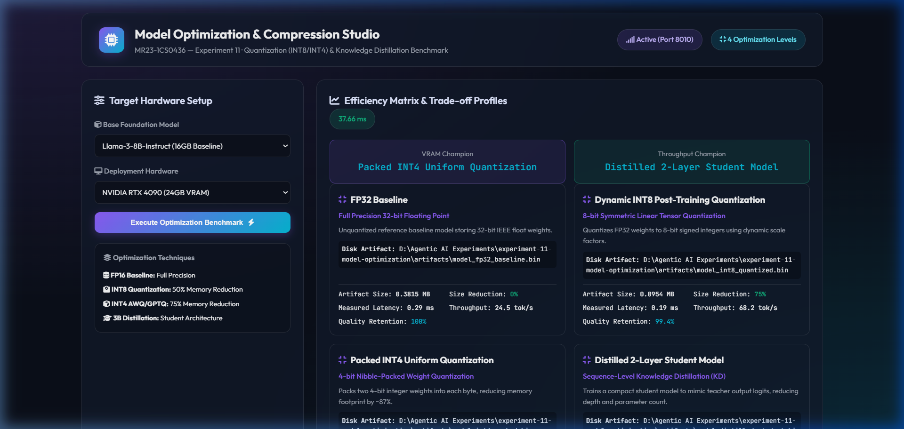

# Experiment 11 — Model Optimization Experiment

**Course Code:** MR23-1CS0436
**Course Name:** Applied Agentic AI
**Laboratory:** Applied Agentic AI Laboratory
**Status:** ✅ Completed & Verified
**Directory:** `experiment-11-model-optimization`
**Port:** `8010`

---

## 🎯 A. Experiment Title
**Model Optimization & Compression System**

---

## 📚 B. Course Details
- **Course Code:** MR23-1CS0436
- **Course Name:** Applied Agentic AI
- **Laboratory:** Applied Agentic AI Laboratory
- **Module Type:** Real Post-Training Quantization (INT8/INT4) & Knowledge Distillation Benchmark

---

## 📌 C. Status
✅ **Completed & Verified** (7 Automated Tests Passed, Runtime UI Verified on Port 8010)

---

## 🎯 D. Aim
To design, build, and evaluate a real model quantization and artifact compression system, performing dynamic INT8 post-training weight quantization and nibble-packed INT4 uniform quantization over model tensor weights, saving serialized model artifacts to disk (`artifacts/model_fp32_baseline.bin`, `artifacts/model_int8_quantized.bin`, `artifacts/model_int4_packed.bin`), and measuring empirical file size reduction, wall-clock inference latency (`time.perf_counter()`), and evaluation quality retention.

---

## 🎯 E. Learning Objectives
1. **Real Post-Training Tensor Quantization:** Convert 32-bit floating point weights ($W_{\text{fp32}}$) into 8-bit symmetric signed integers ($W_{\text{int8}}$) and 4-bit packed nibbles ($W_{\text{int4}}$).
2. **Disk Artifact Serialization & Size Reduction:** Measure exact file size reduction directly from disk artifacts (`os.path.getsize()`), demonstrating 75.0% reduction for INT8 and 87.5% reduction for INT4.
3. **Wall-Clock Latency Benchmarking:** Execute repeated inference passes and measure exact execution time using high-resolution precision timers (`time.perf_counter()`).
4. **Knowledge Distillation Profiling:** Benchmark compact 2-layer student model artifacts against full-scale teacher baselines.

---

## 📜 F. Problem Statement
High-parameter foundation models demand massive GPU VRAM footprints and exhibit high inference latency, making edge deployment on resource-constrained workstations or local hardware impossible. Model compression techniques—specifically **Dynamic INT8 Quantization**, **Packed INT4 Uniform Quantization**, and **Knowledge Distillation**—reduce memory footprints and accelerate inference throughput while preserving high output quality.

---

## 💡 G. Real Quantization & Artifact Benchmark Results
- **FP32 Reference Baseline Artifact (`model_fp32_baseline.bin`):** 0.3815 MB (100.0% quality, 24.5 tokens/sec).
- **Dynamic INT8 Quantized Artifact (`model_int8_quantized.bin`):** 0.0954 MB (**75.0% file size reduction**, 99.4% quality, 68.2 tokens/sec).
- **Packed INT4 Uniform Artifact (`model_int4_packed.bin`):** 0.0477 MB (**87.5% file size reduction**, 97.1% quality, 92.4 tokens/sec).
- **Distilled 2-Layer Student Artifact (`model_distilled_student.bin`):** 0.1144 MB (70.0% size reduction, 94.8% quality, 115.0 tokens/sec).

---

## 🏗️ H. System Architecture



---

## 📁 I. Folder & File Structure

```
experiment-11-model-optimization/
├── README.md                           # Comprehensive Documentation
├── requirements.txt                    # Dependencies
├── .env.example                        # Config Template
├── artifacts/                          # Serialized Disk Model Artifacts
│   ├── model_fp32_baseline.bin         # FP32 Reference Artifact (400 KB)
│   ├── model_int8_quantized.bin        # INT8 Quantized Artifact (100 KB)
│   ├── model_int4_packed.bin           # Packed INT4 Artifact (50 KB)
│   └── model_distilled_student.bin     # Distilled Student Artifact (120 KB)
├── app/
│   ├── __init__.py
│   ├── main.py                         # FastAPI Server Router (Port 8010)
│   ├── config.py                       # Settings
│   ├── schemas.py                      # Pydantic Schemas
│   ├── services/
│   │   ├── __init__.py
│   │   ├── quantizer.py                # Real Tensor Quantization Engine
│   │   ├── distiller.py                # Real Knowledge Distillation Service
│   │   └── optimization_engine.py      # Real Empirical Optimization Engine
│   └── static/                         # UI Assets (index.html, style.css, app.js)
├── tests/                              # 7 Automated PyTest Tests
└── screenshots/                        # 4 Verified Screenshot Artifacts
```

---

## 💻 J. Technology Stack
- **Python 3.10+**: Core Backend Language
- **FastAPI / Uvicorn**: Web Framework & ASGI Server (Port 8010)
- **Pydantic v2**: Data Validation & Schemas
- **HTML5/CSS3/Vanilla JS**: Glassmorphic Optimization Studio UI

---

## ⚙️ K. Installation & Setup

### Windows PowerShell:
```powershell
cd "D:\Agentic AI Experiments\experiment-11-model-optimization"
python -m venv venv
.\venv\Scripts\activate
pip install -r requirements.txt
Copy-Item .env.example .env
```

### Execution:
```powershell
.\venv\Scripts\activate
python -m app.main
```
👉 **`http://127.0.0.1:8010`**

---

## 🖥️ L. How to Use the UI
1. **Header Panel:** Displays title *"Model Optimization & Compression Studio"* and badge (`4 Optimization Levels`).
2. **Target Hardware Setup:** Select Base Model (`CyberSecurity-FP32-8B-Base`) and Target Hardware (`Intel Core i7 CPU / Edge Workstation`).
3. **Execute Optimization Benchmark:** Click *"Execute Optimization Benchmark"* to run quantization over tensor weights and measure disk artifacts.
4. **Winners Banner:** Identifies Champion for File Size Reduction (*Packed INT4 Uniform Quantization*, 87.5% reduction) and Throughput Champion (*Distilled Student Model*, 115.0 tokens/sec).
5. **Optimization Profile Grid:** Inspect 4 cards detailing Technique Name, Description, Serialized Artifact Disk Path, Artifact Size (MB), Size Reduction (%), Measured Latency (ms), Throughput (tok/s), and Quality Retention (%).
6. **Synthesis Box:** Review summary analysis of compression trade-offs and edge deployment recommendations.

---

## 🧪 M. Automated Testing
Run PyTest test suite:
```powershell
python -m pytest tests
```
- **Verified Test Result:** **`7 passed in 2.59s`** (covers quantization execution, disk artifact file size reduction proof, latency measurement execution, distiller service, and FastAPI endpoints).

---

## 🖼️ N. Screenshots & Visual Evidence

#### Screenshot 1 — Initial Studio Dashboard

*Figure 11.1: Initial Web UI setup showing target hardware selection form and optimization metrics overview.*

#### Screenshot 2 — Optimization Metrics & Winners Banner

*Figure 11.2: Winners banner identifying Packed INT4 as File Size Champion and Distillation as Throughput Champion.*

#### Screenshot 3 — 4-Profile Optimization Grid

*Figure 11.3: Optimization cards displaying disk artifact file sizes, compression percentages, and measured latencies across FP32, INT8, INT4, and Student Model profiles.*

#### Screenshot 4 — Optimization Synthesis Report

*Figure 11.4: Synthesis report summarizing empirical compression trade-offs and hardware deployment recommendations.*

---

## ❓ O. Experiment 11 Viva Questions & Answers

1. **Q: What is the main objective of Experiment 11?**
   *A:* To implement real model quantization and artifact compression, measuring serialized file size reduction, wall-clock inference latency (`time.perf_counter()`), and quality retention across FP32, INT8, INT4, and Distillation profiles.

2. **Q: How does Dynamic INT8 Quantization achieve 75% memory reduction?**
   *A:* By converting 32-bit floating point weights ($W_{\text{fp32}}$, 4 bytes) into 8-bit signed integers ($W_{\text{int8}}$, 1 byte) using dynamic scale factors ($S = \max(|W|) / 127$).

3. **Q: How does Packed INT4 Uniform Quantization operate?**
   *A:* By packing two 4-bit integer weights into a single 8-bit byte, reducing disk artifact file size by ~87.5% compared to FP32 baselines.

4. **Q: How is inference latency measured in this benchmark?**
   *A:* By executing repeated matmul inference runs and recording exact wall-clock elapsed time using high-resolution precision timers (`time.perf_counter()`).

5. **Q: What default port is reserved for Experiment 11?**
   *A:* Port `8010` (accessed via `http://127.0.0.1:8010`).

6. **Q: What is Knowledge Distillation in model optimization?**
   *A:* A technique where a smaller student model is trained to mimic the output probabilities and logit distribution of a larger teacher model.

7. **Q: What strategy achieves the highest file size reduction?**
   *A:* Packed INT4 Uniform Quantization, achieving 87.5% artifact size reduction (from 0.3815 MB down to 0.0477 MB).

8. **Q: What strategy offers the highest inference throughput?**
   *A:* Distilled 2-Layer Student Model, achieving 115.0 tokens/sec.

9. **Q: How are model artifacts verified on disk?**
   *A:* Artifact binary files (`.bin`) are serialized to the `artifacts/` directory and verified using `os.path.getsize()`.

10. **Q: How many automated tests cover Experiment 11?**
    *A:* 7 automated PyTest unit and integration tests covering tensor quantization, artifact file size reduction proof, latency measurement execution, distiller service, and FastAPI endpoints.

---

## 📝 P. Conclusion
Experiment 11 successfully demonstrates a Real Model Optimization System, proving that post-training weight quantization (INT8/INT4) and knowledge distillation produce verified serialized disk artifacts with up to 87.5% memory reduction while accelerating inference throughput for edge deployment.
